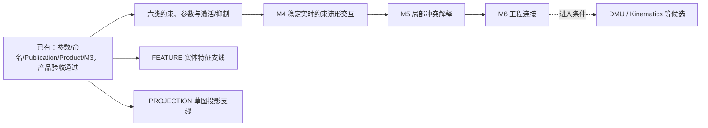

# 统一开发路线

> 2026-09-21 基线核对。计划只保存未完成工作；已实现事实见[当前架构](../docs/CURRENT_ARCHITECTURE.md)，长期合同见[目标架构](../docs/TARGET_ARCHITECTURE.md)。

## 一条主线

产品主线是“六类约束的自洽语义、自由度组合与激活/抑制 → 稳定实时装配交互 → 可解释冲突 → 工程连接”。参数、命名、Publication、Product 上下文与 M3 已是代码基线，不再作为新的开发阶段重复实施；ACCEPT-PRODUCT 已完成，证据见[当前 Product 架构](../docs/architecture/current/product-assembly.md#accept-product-完成记录)。

若只有一条开发线：先 CONSTRAINT-CONTRACT，按装配计划补齐六类及 Activate/Deactivate，再收口 M4 → M5 → M6。会话基础/延迟基准可在合同冻结后与类型补齐并行；最终 M4 验收必须覆盖六类和抑制组合。Revolve/其他 Feature 和 Projection 保持独立支线，不再排在装配能力补齐之前。

## 当前会话优先支线

维护者已提出大文件导入、导入 naming 与原生大模型容量设计需求；本轮先推进[导入与大模型支线](import-large-models.md)。它补齐导入可编辑性、S3/续传、资源预算和渐进显示，不替代上述装配长期主线。IMPORT-DIAGNOSTICS 已完成，记录见[当前架构](../docs/architecture/current/jobs-artifacts.md#import-diagnostics-完成记录2026-09-22)；其余为设计，尚未进行 1 GiB 级验收。

## 可领取工作

| 轨道 | 当前首项 | 依赖与退出门 | 详情 |
|---|---|---|---|
| 装配主线 | CONSTRAINT-CONTRACT | M3/产品验收已就绪；先冻结六类数学语义/组合验证/激活合同 | [装配演进](assembly-evolution.md) |
| 实体支线 | FEATURE-REVOLVE-HISTORY | 已有 Extrude/Boolean 命名基线；完整命名 corpus | [Feature 扩张](feature-expansion.md) |
| 草图支线 | PROJECTION-ARC | 已有 Edge/Vertex 投影；先统一 ARC snapshot | [Sketch 投影](sketch-projection.md) |
| 导入与大模型支线 | LARGE-BASELINE / IMPORT-NAMING | 命名正确性与容量基线先行；对象存储、计算、显示共同验收 | [导入与大模型](import-large-models.md) |
| 工程维护 | 按证据触发 | 保持行为、验证与导航等价 | [维护支线](engineering-maintenance.md) |
| 候选 | 暂不分配开发批次 | 负载、场景或领域前置条件满足后细化 | [候选方向](candidates.md) |

## 编号与状态规则

任务采用 `领域-动作` 稳定标识，不按对话次数、模型名称或随意追加的 P 编号排列。M3–M7 保留为 solver 成熟度门；架构分册的章节号和局部能力优先级都不是计划编号。

状态只用“待实施 / 实施中 / 待验收 / 候选”。完成条目先把实现、代码/测试入口和限制归入当前架构，再从计划删除；仍有效的长期合同归入目标架构。未通过的人工验收不能跟着实现计划一起删除。历史实施记录由 Git 保存，不再复制一套归档计划。

旧编号仅用于查历史：P0–P7 对应特征编辑/naming/装配状态，P8 对应 Part 内关联，P9 对应 Publication/受控外部引用，P10 对应 Product 上下文/M3/Release；上述实现已归入当前分册。P11A–I 对应 FEATURE，P11J/K 对应 PROJECTION，P12/P13/P14 分别对应 M4/M5/M6，P15–P18 与平台扩展已转为有进入条件的候选。新六类能力要求将原 M6 的基础 Offset/Angle 子类型、Contact 与描述符覆盖前移；M6 只保留 Engineering Connections 等扩展，具体以装配计划为准。

## 每项工作的共同完成门

用户场景 → typed command/schema → evaluator/solver → provenance/诊断 → UI/历史 → 验证贯通。持久模型变化覆盖 Undo/Redo、刷新/冷重建、CAS/幂等、依赖和空开发库迁移；Feature 同时覆盖 Shape gate 与 topology history。验证按精确用例 → 受影响领域 → 受影响集成升级，共享 Proto/迁移/构建必须全仓；复杂交互另做真实浏览器验收。

ACCEPT-PRODUCT 的人工确认、标准测试、修复和集成测试限制已归入当前 Product 架构；后续每项工作仍须提供自己的实际验证结果。
