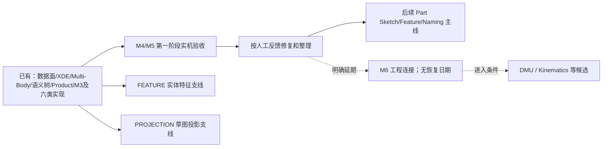

# 统一开发路线

> 2026-10-01 状态核对：`main` / `0b63ddd`，加本轮 M4/M5 第一阶段工作区变更。计划只保存未完成工作；已实现事实见[当前架构](../docs/CURRENT_ARCHITECTURE.md)，长期合同见[目标架构](../docs/TARGET_ARCHITECTURE.md)。

## 一条主线

产品主线是“六类约束的自洽语义、自由度组合与激活/抑制 → 稳定实时装配交互 → 可解释冲突 → 工程连接”。参数、命名、Publication、Product 上下文与 M3 已是代码基线，不再作为新的开发阶段重复实施；ACCEPT-PRODUCT 已完成，证据见[当前 Product 架构](../docs/architecture/current/product-assembly.md#accept-product-完成记录)。

数据面（S3、制品外置、轻量响应）、XDE 基础交换（共享 Definition、嵌套层级、parse-once）、Multi-Body 与 TREE-01/02/03 基础整改已经收口，作为当前基线，不再列为新阶段。实现与限制见[几何制品](../docs/architecture/current/geometry-representations.md)、[交换与 Jobs](../docs/architecture/current/jobs-artifacts.md)、[TREE-02](../docs/architecture/current/tree02-model-display.md)和[TREE-03](../docs/architecture/current/tree03-product-edit-tabs.md#验证与限制)。TREE-03 本轮使用验证通过来自维护者反馈；不代表全量、容量、跨窗口或并发验收通过。

```mermaid
flowchart LR
    Baseline["已有：数据面/XDE/Multi-Body/语义树/Product/M3及六类实现"] --> Acceptance["M4/M5 第一阶段实机验收"]
    Acceptance --> Closeout["按人工反馈修复和整理"]
    Closeout --> Part["后续 Part Sketch/Feature/Naming 主线"]
    Closeout -.明确延期.-> Connection["M6 工程连接；无恢复日期"]
    Baseline --> Feature["FEATURE 实体特征支线"]
    Baseline --> Projection["PROJECTION 草图投影支线"]
    Connection -.进入条件.-> Future["DMU / Kinematics 等候选"]
```

若只有一条开发线：完成 M4/M5 第一阶段自动收口后，由维护者实机验证，再按反馈修复和整理；不从零重领 Session 或六类实现。后续主线转向 Part Sketch/Feature/Naming，具体批次沿用既有队列，本轮不提前实施。M6 明确延期，不是自动领取的下一任务。

## 当前决策与下一主任务

CONSTRAINT-CONTRACT 的目录、真实测试 adapter 和回归门已复用到本轮六类补齐：公共 v2 定义/能力查询、八类精确 descriptor 与稳定派生支持、六类数值与参数、激活/来源恢复、真正的多成员组内先解/组外后解、冻结历史及发布链已进入当前实现，见[当前 Product](../docs/architecture/current/product-assembly.md#六类公共定义精确支持与生命周期)。已实现能力不再作为下一轮开发待办。

当前状态为 **M4/M5 第一阶段实现完成，等待维护者实机验收**，随后按反馈修复和整理。连续目标、瞬态 Session、严格最终候选和只读局部诊断已进入真实产品链路；代码入口、完整自动报告、性能实测与限制见[当前实现](../docs/architecture/current/product-assembly.md#m4m5-第一阶段连续操纵与局部解释)。六类及生命周期的既有 CONSTRAINT-COMPOSITION 基线继续复用，不重复开发 Offset、Contact 或 Fix Together；新发现的真实失败必须保留并修复，不能降低合同。真实50-body连通性能未达100ms，浏览器60Hz未测，不与实现完成混为一谈。

维护者已反馈六类主要能力可用、速度和稳定性明显改善，并确认最近候选、图标及相关交互 Bug 已解决；没有同环境性能数据，不扩展为工业语料、加速比或所有并发场景验收，也不代签本轮新 M4/M5。九个 CONSTRAINT-* 标识在[装配计划](assembly-evolution.md#六类约束与生命周期补齐)保留稳定导航和尚未覆盖的验收出口。Feature、Projection、大模型及工程维护保持各自队列，只有明确的新需求才调整执行优先级。

## 可领取工作

| 轨道 | 当前首项 | 依赖与退出门 | 详情 |
|---|---|---|---|
| 装配主线 | M4/M5 第一阶段验收与反馈收口 | 自动证据和真实性能单列；实机通过且反馈缺陷闭环后结束第一阶段验收；M6 明确延期 | [装配演进](assembly-evolution.md) |
| 实体支线 | FEATURE-REVOLVE-HISTORY | 已有 Extrude/Boolean 命名基线；完整命名 corpus | [Feature 扩张](feature-expansion.md) |
| 草图支线 | PROJECTION-ARC | 已有 Edge/Vertex 投影；先统一 ARC snapshot | [Sketch 投影](sketch-projection.md) |
| 导入与大模型支线 | LARGE-BASELINE | 命名正确性与容量基线先行；对象存储、计算、显示共同验收 | [导入与大模型](import-large-models.md) |
| 工程维护 | 按证据触发 | 保持行为、验证与导航等价 | [维护支线](engineering-maintenance.md) |
| 语义树后续 | 按真实场景进入，不自动新开 TREE-04 | Feature 贡献索引、子树按需查询/大树基准、Publication 引用查看/跨 Workspace 并发依赖、更多参数类型/生命周期；各项以对应索引、查询基准或并发/历史闭环为退出门，不全部设为装配前置 | [当前边界](../docs/architecture/current/tree03-product-edit-tabs.md)、[语义树设计](../docs/architecture/semantic-tree-interaction.md) |
| 候选 | 暂不分配开发批次 | 负载、场景或领域前置条件满足后细化 | [候选方向](candidates.md) |

## 编号与状态规则

任务采用 `领域-动作` 稳定标识，不按对话次数、模型名称或随意追加的 P 编号排列。M3–M7 保留为 solver 成熟度门；架构分册的章节号和局部能力优先级都不是计划编号。

状态只用“待实施 / 实施中 / 待验收 / 候选”。完成条目先把实现、代码/测试入口和限制归入当前架构，再从计划删除；仍有效的长期合同归入目标架构。未通过的人工验收不能跟着实现计划一起删除。历史实施记录由 Git 保存，不再复制一套归档计划。

旧编号仅用于查历史：P0–P7 对应特征编辑/naming/装配状态，P8 对应 Part 内关联，P9 对应 Publication/受控外部引用，P10 对应 Product 上下文/M3/Release；上述实现已归入当前分册。P11A–I 对应 FEATURE，P11J/K 对应 PROJECTION，P12/P13/P14 分别对应 M4/M5/M6，P15–P18 与平台扩展已转为有进入条件的候选。新六类能力要求将原 M6 的基础 Offset/Angle 子类型、Contact 与描述符覆盖前移；M6 只保留 Engineering Connections 等扩展，具体以装配计划为准。

## 每项工作的共同完成门

用户场景 → typed command/schema → evaluator/solver → provenance/诊断 → UI/历史 → 验证贯通。持久模型变化覆盖 Undo/Redo、刷新/冷重建、CAS/幂等、依赖和空开发库迁移；Feature 同时覆盖 Shape gate 与 topology history。验证按精确用例 → 受影响领域 → 受影响集成升级，共享 Proto/迁移/构建必须全仓；复杂交互另做真实浏览器验收。

ACCEPT-PRODUCT 的人工确认、标准测试、修复和集成测试限制已归入当前 Product 架构；后续每项工作仍须提供自己的实际验证结果。
