# P7 后关联设计、Feature 与装配演进计划

状态：实施中；P8A–P8C 实现完成，待浏览器人工验收
规划基线：2026-09-15  
前置能力：P0–P7 已完成；P7 浏览器/WebGL 人工验收已完成  
当前 ready queue：P8A–P8C 人工验收；通过后进入 P8D

## 1. 目标与主线判断

P7 已经为 Linear Extrude/Boolean 的 Face、Edge、Vertex 建立首个可持久解析的拓扑身份，并在 Product 中验证了跨 Part Revision 的装配引用。后续最有价值的工作不是彼此独立地增加 Feature、约束枚举和骨架模型，而是建立一条共同的关联设计主干：

```text
稳定参数身份
  -> Part 内参数依赖
  -> Part 内几何依赖
  -> Publication 工程接口
  -> 跨文档冻结引用与关联更新
  -> Product 可重放求解输入
  -> 约束流形交互、冲突解释和 Engineering Connection
```

这条主干把 P7 的“对象是谁”扩展为“谁依赖它、何时重算、使用哪个 Revision、失败时如何诊断”。Feature 扩展、骨架设计和 Assembly M3–M6 都复用同一套 stable ID、PersistentSelection、Publication、dependency snapshot 和更新状态，不建立第二套引用协议。

下一阶段分为三条相互依赖的工作流：

1. **关联 Part 主线**：ParameterBinding、面支撑草图、ExternalGeometry、Publication、Skeleton pilot；
2. **Feature 深化线**：先补齐已有 Revolve，再实现 Hole、Fillet/Chamfer、Pattern/Mirror、Shell/Draft；
3. **装配演进线**：Publication 最小合同就绪后完成 M3，再按 M4、M5、M6 推进。

共享对象存储、跨主机 Scheduler、独立 Assembly Worker、任意曲面草图、通用曲面接触和大规模稀疏后端不作为近期模型正确性的前置工程，由部署需求、代表性 corpus 和 benchmark 触发。

## 2. 批次粒度与执行规则

本计划中的 **阶段** 使用 P8、P9 等编号；真正对应一次 `Codex gpt-5.6-sol medium` 对话的是 P8A、P8B 这样的 **开发批次**。一次对话只领取一个开发批次，完成实现、验证和事实文档闭环后再进入下一批。

每个开发批次必须满足以下边界：

- 有一个清晰的用户场景和一个权威领域行为，不把纯 UI shell 或孤立类型声明算作完成；
- 跨越 Web、Go、Proto、Worker、OCCT 时贯通本批所需的完整调用链；不需要跨越的边界不机械修改；
- 参数、单位、稳定身份、Revision、ChangeSet、dependency edge、evaluator/solver provenance 和失败诊断遵守现有平台不变量；
- 新增或改变持久模型时同步覆盖 Undo/Redo、刷新重载、冷重建、CAS/idempotency 和开发数据空库迁移；
- Geometry/Assembly 行为有确定性 kernel 或 service corpus，浏览器交互有场景测试、production build 和人工验收；
- 完成后更新 `docs/CURRENT_ARCHITECTURE.md` 的已实现事实；目标语义发生调整时才修改 `docs/TARGET_ARCHITECTURE.md`；
- 批次未通过验收时不提前领取依赖它的后续批次，也不把未完成部分悄悄转移到下一批。

默认验证从匹配用例的 `invoke check --scope <domain> --match <test>` 开始，随后运行无 `--match` 的受影响领域检查、必要的跨域集成和最终 `invoke check --scope all`。复杂 Web 交互必须补充重启后的浏览器人工验收。

## 3. 依赖图与可并行边界

```mermaid
flowchart LR
    P7["P7 Persistent Naming<br/>已完成"] --> P8A["P8A Sketch ParameterBinding"]
    P8A --> P8B["P8B Part 参数表达式引用"]
    P8B --> P8C["P8C PLANAR_FACE 支撑"]
    P8C --> P8D["P8D ExternalGeometry 投影"]
    P8D --> P8E["P8E 关联失效与重连"]
    P8E --> P8F["P8F Part 关联设计验收"]

    P8F --> P9A["P9A Datum Publication"]
    P9A --> P9B["P9B Topology Publication"]
    P9B --> P9C["P9C Published Parameter"]
    P9C --> P9D["P9D Update References"]
    P9D --> P9E["P9E Product Publication"]
    P9E --> P9F["P9F Skeleton Pilot"]
    P9F --> P9G["P9G 跨文档验收"]

    P9E --> P10A["P10A typed InstancePath"]
    P10A --> P10B["P10B SolveManifest Builder"]
    P10B --> P10C["P10C Replay 与 Router"]
    P10C --> P10D["P10D M3 迁移验收"]
    P10D --> P12A["P12A M4 Session"]
    P12A --> P12B["P12B Null-space Drag"]
    P12B --> P12C["P12C Product UX"]
    P12C --> P12D["P12D DirectedAngle"]
    P12D --> P13A["P13A Conflict Corpus"]
    P13A --> P13B["P13B Conflict Search"]
    P13B --> P13C["P13C Repair UX"]
    P13C --> P14A["P14A Constraint Coverage"]
    P14A --> P14B["P14B Connector"]
    P14B --> P14C["P14C Connections"]
    P14C --> P14D["P14D Contact"]
    P14D --> P14E["P14E Descriptors"]
    P14E --> P14F["P14F Limits"]

    P8F --> P11A["P11A Revolve Naming"]
    P11A --> P11B["P11B Revolve 完整闭环"]
    P11B --> P11C["P11C Hole"]
    P11C --> P11D["P11D Fillet"]
    P11D --> P11E["P11E Chamfer"]
    P11E --> P11F["P11F Pattern"]
    P11F --> P11G["P11G Mirror"]
    P11G --> P11H["P11H Shell"]
    P11H --> P11I["P11I Draft"]
```



P8 是近期唯一主路径。P8 完成后，P9 与 P11 可以并行；P10 在 P9E 的 Publication/Product endpoint 合同完成后启动；P12–P14 严格沿 M3–M6 顺序推进。若只有一条串行开发线，顺序采用 P8 → P9 → P10 → P11 → P12 → P13 → P14。

## 4. P8：Part 内关联设计基础（实现完成，待人工验收）

### P8A：Sketch 驱动尺寸 ParameterBinding（实现完成，待人工验收）

**目标场景**：用户创建或编辑 Distance、Length、Radius、Diameter、Angle 等驱动尺寸后，尺寸拥有稳定 ParameterId，表达式文本与 SI 规范值分离，重开文档后身份不变。

**实施范围**：

- 将现有草图数值约束接入统一 ParameterBinding/PropertySlot，而不是在 Constraint 中保存匿名数值；
- 注册量纲、单位、默认显示名和稳定 ParameterId 派生规则；
- `EDIT_SKETCH`、求解快照、ChangeSet、Undo/Redo 和属性面板贯通；
- 迁移当前开发 schema 的唯一实现，不增加旧实验数据 adapter；
- 覆盖全部现有驱动尺寸类型的 round-trip 与 solver 输入等价。

**验收**：创建尺寸、20 mm → 40 mm 编辑、表达式/计算值展示、Undo/Redo、刷新和清缓存冷重建均保持同一 ParameterId；PlaneGCS 与持久 Revision 的规范值一致。

**实施记录（2026-09-17）**：五类现有驱动尺寸均已映射到稳定 `ParameterId` 和 typed `PropertySlot`；源文本、显示单位、SI 规范值及计算值分离。`EDIT_SKETCH`、PlaneGCS 输入、ChangeSet、Undo/Redo 和右侧参数编辑器已贯通，并增加尺寸身份、20 mm → 40 mm 与表达式 tombstone 恢复测试。

### P8B：同一 Part 内的参数表达式引用（实现完成，待人工验收）

**目标场景**：第二个草图尺寸或 Feature 参数可写为第一个稳定参数的表达式，例如孔宽 `base_width / 2`、Pad 长度 `sketch_height * 3`。

**实施范围**：

- 在现有 typed expression AST 上开放同一 Part 内 ParameterId 引用；
- UI 使用可读别名编辑，但持久 AST 绑定稳定 ID，重命名不改变引用；
- 生成 typed dependency edges、dirty closure 和 cycle/dimension diagnostics；
- Feature edit preview 与 commit 使用相同求值规则；
- 参数删除、单位不匹配、循环依赖和上游失败有稳定错误码。

**验收**：跨两个 Sketch/Feature 的表达式更新只重算 dirty closure；增量与全量求值等价；重命名保持引用；循环和量纲错误不会产生新 Head。

**实施记录（2026-09-17）**：表达式继续以可读别名输入，但 checked AST 和 `READ_VALUE` edge 绑定稳定 ID；新增参数重命名命令及 AST 安全重渲染。参数求值统一前置于草图求解，缺失引用、循环、类型和量纲错误均在提交新 Head 前返回稳定诊断；服务与 Web 场景检查已通过。

### P8C：PLANAR_FACE 草图支撑（实现完成，待人工验收）

**目标场景**：用户选择 Pad 的稳定平面 Face 创建草图；上游 Pad 长度变化后，草图仍位于同一语义面及确定的局部坐标框架。

**实施范围**：

- `SketchSupport` 增加 `PLANAR_FACE`，引用 PersistentSelection；
- 保存并验证支撑面的 origin、X direction、normal 和定向规则；
- resolver 在求解草图前解析支撑面并形成 dependency snapshot；
- 上游支撑删除、歧义和类型变化分别形成 `FAILED_SUPPORT`/明确诊断；
- Web 支持从 viewport/tree 选择平面面创建草图，并正确显示支撑与失败状态。

**验收**：上游 Pad 编辑、Undo/Redo、Worker 重启和冷重建后支撑框架确定一致；真实删除支撑面不会把草图静默移动到默认平面；浏览器完成创建、编辑和失败状态人工验收。

**实施记录（2026-09-17）**：`SketchSupport` 已支持 `PLANAR_FACE`、`PersistentSelection`、确定性 frame/orientation 与 dependency snapshot；服务按 Feature 顺序、针对草图前完整 body prefix 解析支撑，并以 `READ_TOPOLOGY` 和显式 body-tip chain 进入依赖图。Viewport 面选择可直接创建草图，结构树和属性面板显示支撑状态、semantic anchor、snapshot 与诊断；自动化检查已通过，浏览器/WebGL 的创建、上游编辑、失败状态及重启/冷重建仍由本轮人工验收确认。

**验收修正（2026-09-17）**：Sketcher 不再隐藏当前 Body，而是把权威制品作为不可编辑上下文层持续显示，活动草图保持前景 overlay 和独立选择域。面上 boss/pocket 暴露的 Boolean history 缺口由 `occccad.topology.contract.v3` 的 semantic adjacency closure 补齐；严格完整 Shape gate 保留，不能通过关闭 naming 检查或持久化 local ID 绕过。

### P8D：ExternalGeometry Edge/Vertex 正交投影（实现完成，待人工验收）

**目标场景**：在面支撑草图中选择上游 Edge 或 Vertex 执行“投影/使用外部几何”，投影结果只读但可以参加草图约束。

**实施范围**：

- 定义稳定 ExternalId、来源 PersistentSelection、projection kind、source digest 和二维 curve/point snapshot；
- 第一批支持线性 Edge、圆 Edge 和 Vertex 的正交投影；
- 生成可被 Coincident、Distance、Tangent 等现有约束引用的稳定子元素；
- ExternalGeometry 不伪装普通 Sketch Entity；提供显式 `DETACH_EXTERNAL_GEOMETRY`；
- 权威投影在 Worker 完成，浏览器只负责交互预览和显示。

**验收**：Pad 面上草图投影四条边并建立受约束矩形；编辑上游长度后重新解析和投影；Detach 后上游再变化不影响普通实体；刷新和冷重建等价。

**实施记录（2026-09-17）**：SketchFeature v2 增加与普通 Entity 分离的 ExternalGeometry 集合，保存稳定 ExternalId、PersistentSelection、projection kind、source/dependency digest 与二维 snapshot。Geometry Worker 新增 `ProjectExternalGeometry`，权威支持 linear Edge、完整 circular Edge 和 Vertex 的正交投影；服务端把投影作为 fixed geometry 接入现有约束求解，并提供保持 ID 的 Detach。Web 增加显式投影工具、虚线外部几何、稳定树节点及属性投影。

### P8E：ExternalGeometry 更新、失效与 Reconnect（实现完成，待人工验收）

**目标场景**：投影来源在 Cut、split、merge 或删除后，能够继续解析、明确进入歧义/失效状态，或由用户 Reconnect。

**实施范围**：

- 上游更新按 naming resolver → projection → Sketch solve → downstream Feature 的固定阶段执行；
- 定义 `UNRESOLVED_EXTERNAL`、ambiguous、type mismatch、projection degenerate 等诊断；
- 列出受影响 constraint、profile region 和 downstream Feature；
- Reconnect 重新绑定 PersistentSelection，但保持 ExternalId 和下游引用身份；
- Broken 外部几何不以旧二维 snapshot 冒充当前权威成功结果。

**验收**：覆盖保留、删除、split ambiguity、merge、类型变化和退化投影；无关 dependency component 仍可更新；Reconnect、Undo/Redo 和再次上游编辑均正确。

**实施记录（2026-09-17）**：每次 Part 求值固定执行 naming resolve → projection → sketch solve → feature evaluation。缺失、歧义、类型不符和退化投影具有稳定诊断，失败项会清除旧 snapshot、列出受影响约束/profile/downstream Feature，并生成可检查和 Reconnect 的 FAILED Revision；Reconnect 重绑来源但保持 ExternalId。结构树提供 Reconnect 与“断开外部关联并冻结”。

### P8F：Part 关联设计完整验收与基线冻结（实现完成，待人工验收）

**目标场景**：一个 Part 中由参数驱动基础草图和 Pad，在 Pad 面上创建第二草图，投影边并 Remove；改变基础参数后整条依赖链确定性重建。

**实施范围**：

- 建立跨 ParameterBinding、PLANAR_FACE、ExternalGeometry、Profile、Linear Extrude/Boolean 的综合 corpus；
- 比较增量重算与清缓存全量重算的语义结果、dependency snapshot 和 manifest digest；
- 验证连续编辑、Undo/Redo、刷新、Worker 重启和失败恢复；
- 补齐 capability、deadline/cancel、资源限制和浏览器 E2E；
- 将 P8 已实现事实同步到 CURRENT 与所属 README。

**验收**：代表性“基体 → 面上草图 → 投影 → 孔/切除”场景在正式 Router 和浏览器中通过；任何失败均定位到稳定 Parameter/Selection/External/Feature ID；`invoke check --scope all` 通过。

**实施记录（2026-09-17）**：协议、Router、Worker、Part dependency graph、Revision 状态、Visualization、结构树、属性面板和 Sketcher 工具链已贯通。自动化覆盖 Worker 点/线/圆投影及退化诊断、Router 转发、External 引用验证、READ_TOPOLOGY、Detach 稳定身份、broken snapshot 禁用和浏览器投影手势；综合检查结果记录在本次实现交付。浏览器/WebGL 的真实“基体 → 面上草图 → 四边投影 → Remove → 上游参数编辑 → Reconnect/Detach”仍留给本轮人工验收。

## 5. P9：Publication、跨文档参数与 Skeleton Pilot

### P9A：Publication 核心合同与 Datum 接口

**目标场景**：Part 可以把稳定 Datum 发布为工程接口，rename 不破坏消费者，并为后续拓扑、Feature output 和参数 Publication 冻结共同合同。

**实施范围**：

- 定义 PublicationId、type、semantic purpose、compatibility version 和 target；
- 第一批只支持稳定 Datum 对应的 POINT、AXIS、PLANE、FRAME；
- target 更新时验证类型、frame/symmetry 和合同兼容性；
- Publication 创建、编辑、删除和重定向使用 typed Domain Command；
- 属性面板、结构树和 viewport 可以定位 Publication 与实际 target。

**验收**：rename 保持身份；兼容重定向保持消费者；不兼容重定向明确失败或产生 `BROKEN_PUBLICATION`；Undo/Redo 和冷重建通过。

### P9B：拓扑与 Feature output Publication

**目标场景**：Part 可以把已完成 naming 的 Edge、Face 或 Body 作为 CURVE、SURFACE、BODY 工程接口发布，消费者不需要知道内部 Feature 路径。

**实施范围**：

- Publication target 支持 PersistentSelection 和稳定 Feature output；
- resolver 输出 geometry kind、local frame、symmetry、source digest 和 provenance；
- 内部 Feature 编辑后按 naming 重解 target，删除/歧义/类型改变产生稳定 Publication 诊断；
- target 兼容重定向保持 PublicationId，下游无需改写引用；
- 建立 Linear Extrude/Boolean Face、Edge、Body 的 contract corpus。

**验收**：上游长度编辑、Cut、split/merge、删除和 Reconnect 后 Publication 状态确定；重命名与内部 Feature reorder 不影响 PublicationId；冷重建结果一致。

### P9C：Published Parameter 与 ExternalParameterRef

**目标场景**：骨架 Part 发布 `overall_width`，另一个 Part 通过 PublicationId 引用它，而不读取显示名或任意内部参数。

**实施范围**：

- 增加 PARAMETER Publication，合同包含 value type、dimension、unit policy、bounds 和 source ParameterId；
- ExternalParameterRef 保存 source document、ReferenceSelector、PublicationId 和 expected type；
- 下游 Revision 保存 resolved RevisionId 和 value digest；
- 权限、来源删除、合同版本/量纲不兼容和 dependency cycle 有明确诊断；
- 下游表达式继续绑定自己的 stable ParameterId dependency edge。

**验收**：跨文档参数驱动 Part Feature；上游 rename 不影响引用；数值更新、删除、类型变化、循环和冷重建均有确定结果。

### P9D：Update References Transaction

**目标场景**：来源 Workspace Head 更新后，下游显示 `UPDATE_AVAILABLE`；用户打开或返回 Product/Part 时可自动触发一次显式、可审计的更新事务。

**实施范围**：

- 建立冻结 Revision 的 Reference Resolution Snapshot；
- 区分“检测到新 Head”和“接受并重算”的领域动作；
- Update References 在数据库事务外完成候选重算，再以 Workspace sequence CAS 提交；
- 自动 FOLLOW_HEAD UX 复用同一个幂等 Domain Command，不允许已提交 Revision 静默漂移；
- 支持 update preview、影响闭包、部分失败诊断和迟到结果拒绝。

**验收**：上游连续两次编辑、下游并发编辑、重复更新请求和 stale candidate 均不会覆盖新 Head；一次成功更新形成一个可 Undo 的 ChangeSet。

### P9E：Product Publication endpoint 与替换重连

**目标场景**：装配约束优先连接 Part Publication；替换为合同兼容的 Part 后自动解析到新 target，不依赖旧 Part 的任意 face identity。

**实施范围**：

- AssemblyGeometryRef 支持 PublicationRef，并保留 PersistentSelection deep link；
- Product Publication 可以转发相对 occurrence 的子 Publication；
- descriptor adapter 保留 kind、local frame、symmetry 和 provenance；
- Replace/Update 前验证已使用 Publication contracts；
- Connected/NotConnected 与 NotUpdated/Broken/Impossible/Verified 继续由 resolution 和 solver evidence 派生。

**验收**：基于 Plane/Axis/Point Publication 创建约束；兼容替换后 Verified，不兼容替换后 Broken；Reconnect、Undo/Redo、冷服务解析和正式 Router 通过。

### P9F：最小 Skeleton/ContextReference 试点

**目标场景**：一个普通 Part 作为 Skeleton，发布基准面、轴、主草图曲线和驱动参数；两个消费 Part 通过 Publication 构建实体，并在 Product 中保持装配关联。

**实施范围**：

- 第一版不新增特殊 Skeleton 文档类型，以普通 Part + Publication 表达工程接口；
- ContextReference 保存 owning Part Workspace、root Product Resolution Snapshot、source InstancePath、Publication/PersistentSelection 及变换到 owning Part frame 的 Transform；
- 引用保持单向 DAG，禁止从消费 Part 隐式读取 sibling 内部对象；
- 同一共享 Part 的 occurrence-specific context 必须拒绝或显式派生 Context Variant；
- 提供 Isolate/Detach，把外部引用固化为本地普通参数/几何。

**验收**：Skeleton 更新后两个消费 Part 经显式更新一致重建；循环依赖和共享 Part 的不合法 occurrence context 被拒绝；Isolate 后来源变化不再传播。

### P9G：跨文档关联设计端到端验收

**目标场景**：Skeleton 参数/几何 → 两个 Part → Product Publication 约束形成完整链；上游编辑、删除、替换和重连具有一致状态。

**实施范围**：

- 建立跨文档 frozen snapshot、Update References、Part regeneration 和 Product solve 的综合 fixture；
- 覆盖更新可用、接受更新、Broken 隔离、兼容 Replace、Reconnect 和撤销；
- 输出可保存的 evaluation/resolve/solve replay 证据；
- 浏览器从 Skeleton 编辑到 Product 更新完成真实人工验收；
- 冻结 P9 合同，成为 M3 manifest 的唯一 Publication 输入。

**验收**：整条链在刷新、服务重启、缓存清空和正式 Router 后保持语义等价；删除 Publication 时下游 Part 和 Product 都能指出同一个稳定失败来源；全仓检查通过。

## 6. P10：Assembly M3 可重放 Product SolveManifest

### P10A：typed relative InstancePath 与嵌套 rigid Product

**目标场景**：同一个 Part 在不同嵌套 Product 路径中出现时，约束和 Publication 精确引用 occurrence，而不是展示字符串或数组位置。

**实施范围**：typed root/segment identity、稳定 member semantics、路径 canonicalization、nested rigid expansion、reparent/replace rewrite plan，以及 path cycle/depth/size gate。

**验收**：重复 Part、多层 Product、rename、reorder、reparent 和 replace 后路径解析确定；无法唯一重写时拒绝命令。

### P10B：ResolutionSnapshot 与 SolveManifest Builder

**目标场景**：一次 Product 求解冻结 root Revision、完整 occurrence pose、引用解析证据、约束和 solver profile，构造不可变 manifest。

**实施范围**：manifest schema/canonical digest、Publication/PersistentSelection endpoint、descriptor kind/frame/symmetry/provenance、branch/tolerance/build/scope、rigid expansion；Broken/ambiguous/incompatible 在 builder 阶段失败。

**验收**：相同输入生成相同 digest；Workspace Heads 移动不改变既有 manifest；solver 不查询 Product、数据库或 B-Rep。

### P10C：M3 replay、Router 与 provenance

**目标场景**：下载或持久保存的 SolveManifest 可以不依赖业务数据库重放，并证明使用了同一数学问题和版本。

**实施范围**：Worker/Router 粗粒度 RPC、manifest replay、request-specific lookup、solver result provenance、resource/deadline/cancel，以及现有 `.3dreplay` 与正式 manifest 的职责对齐。

**验收**：跨 Worker 重启、Head 移动和缓存清空重放语义等价；未知 request 不回退其他记录；失败诊断保留 manifest identity。

### P10D：M3 唯一路径迁移与验收

**目标场景**：所有正式 Product solve、preview 和 commit 都经 M3 builder；删除 direct-Part/topology local ID 的开发旁路。

**实施范围**：迁移 Product adapter、约束创建/编辑/更新、MOVE preview 和 replay；覆盖 nested rigid Product、Publication 更新、Broken/ambiguous；保留 M2.5 数值、DOF、偏好和历史 corpus。

**验收**：M3 文档中的全部 acceptance criteria 通过；旧旁路无生产调用方；正式浏览器 Product 场景和 `invoke check --scope all` 通过。

## 7. P11：Feature 深化与 naming 覆盖

P11 在 P8 完成后可与 P9/P10 并行。每个 Feature 批次都必须同时完成 typed schema、编辑、表达式参数、validator、canonical hash、evaluator version、OCCT Shape gate、topology history、PersistentSelection、UI、Undo/Redo、资源诊断和 corpus；单独增加工具栏按钮或 OCCT 调用不算完成。

### P11A：Revolve semantic naming 与 history

补齐旋转生成面、cap、seam、axis degeneracy、full/partial angle 和 Boolean 后续历史；覆盖 Face/Edge/Vertex resolver。

### P11B：Revolve 编辑和关联闭环

贯通方向、角度、轴引用、New/Add/Remove/Intersect、预览、属性编辑、面上草图和 Product 引用；以完整 E2E 冻结 Revolve 基线。

### P11C：Hole 工程 Feature

实现独立 Hole schema，第一批支持 Blind、Through All、方向、直径和深度；支撑面/轴使用 PersistentSelection/Publication，不能长期只把 Hole 表达为匿名 Remove。

### P11D：Fillet

先支持等半径常规 Edge 集；重点验证 Edge split/merge、半径失败、切线传播策略、naming 歧义和下游引用。

### P11E：Chamfer

支持距离/距离和距离/角度的受控子集；复用 Fillet 的 Edge selection/history gate，但保持独立 typed semantics。

### P11F：Part Pattern

先实现线性/圆周 Feature Pattern；每个成员使用稳定 member key，数量变化产生可解释的保留和 tombstone，不能按数组下标顶替身份。

### P11G：Mirror

实现 Feature/Body 镜像的明确策略、镜像坐标框架和 member identity；不使用负 scale 伪造刚体或拓扑身份。

### P11H：Shell

先用代表性 corpus 评估 OCCT history 完整度和 naming 风险，再完成等厚、向内/向外及移除面子集的首个全链路切片；无法可靠传播 history 的 case 必须明确诊断。

### P11I：Draft

基于稳定 neutral plane、pull direction 和 Face selection 实现常角度 Draft 子集；覆盖方向翻转、零/极限角、面删除和下游引用。Loft/Sweep 在 section 对应、seam 和 guide identity 设计完成后另立计划。

## 8. P12：Assembly M4 分支稳定的约束流形交互

### P12A：版本化 preview session 与 branch snapshot

Session 绑定 base Workspace sequence 和 SolveManifest digest，保存 accepted pose、branch 和 warm-start snapshot；它是可丢弃的交互状态，不进入 Revision。

### P12B：null-space drag objective

用 M2/M2.5 null-space 在硬约束可行流形上最小化拖拽目标，替换临时 `interaction-driver` Fix；返回最近可行 pose。

### P12C：allowed/blocked direction 与 Product UX

贯通平移/旋转手柄、受限方向反馈、迟到响应丢弃、最终 accepted frame 和一次 pointerup commit；保留同一选择与手柄生命周期。

### P12D：DirectedAngle 与 M4 验收

加入显式 Datum/Publication axis 和 sense；静态 Revision 保存 branch intent，unwrapped/winding 留在 Interaction/Kinematics；完成闭环、0/π/2π 邻域和不可达拖拽 corpus。

## 9. P13：Assembly M5 局部冲突解释

### P13A：确定性冲突 corpus 与 evidence contract

建立多约束冗余、矛盾、branch、容差和退化场景；定义 proven minimal、irreducible、localized suspect、unsatisfied 和 budget exhausted。

### P13B：局部邻域与 bounded conflict search

从 changed constraint 和 incidence graph 构造邻域，组合 rank/branch evidence 与 bounded deletion filtering 或 QuickXplain；耗尽预算返回部分证据，不伪造 MUS。

### P13C：诊断与修复 UX

按稳定 Connection/Constraint/Equation ID 高亮结构树和 viewport，提供 suppress/measure/reconnect 候选动作；任何修复都由显式 Domain Command 提交。

## 10. P14：Assembly M6 Engineering Connections

### P14A：Offset、Parallel、Perpendicular

在现有 Point/Axis/Plane/Cylinder descriptor 上增加 typed definitions、解析 Jacobian、branch、DOF 和诊断 corpus。

### P14B：Frame/Connector Publication

Connector 合同增加接口种类、frame、对称性、极性、允许 Connection、名义间隙/尺寸和自定义属性。

### P14C：基础 Engineering Connections

实现并用实际 M2.5 freedom 验证 Rigid、Revolute、Prismatic、Cylindrical、Planar Connection；声明类型不能替代方程和 DOF 验证。

### P14D：受控定位 Contact

先实现解析 plane/plane 和 cylinder 定位 Contact 子集，明确接触侧、branch、退化和多解诊断；不把 mesh 碰撞或任意最近点冒充权威定位约束。

### P14E：Circle、Sphere 与 Cone descriptor

逐类增加 descriptor、Publication resolution、适用约束、解析 Jacobian、symmetry 和 corpus；一次实现保持在这三个有界解析几何族内。

### P14F：Distance、Angle 与 Joint limits

增加有界距离、角度和 joint limit 的 active-set/branch 语义、状态与交互诊断。任意 NURBS-NURBS 接触、gear/rack 和复杂曲面接触另立后续研究计划。

## 11. 后续候选阶段

以下方向长期重要，但在 P8–P14 主干形成前不作为近期承诺：

- **P15 参数产品化**：Configuration、Design Table、Rule、Check、Release Gate、批量参数研究；
- **P16 Surface/3D Wire**：稳定 3D curve/section/guide identity 后再进入 Sweep、Loft 和曲面 Feature；
- **P17 DMU 与替换管理**：BOM/effectivity、flexible subassembly、clash/clearance、section、persistent issue；
- **P18 Kinematics**：Mechanism、FK/IK、joint driver/law、limits、trace 和 swept envelope；
- **M7 规模决策**：代表性 benchmark 后决定 block-sparse、增量 factorization、backend 和 Worker 边界；
- **平台扩缩容**：共享对象存储、跨主机 Geometry 调度和长计算任务化，由真实部署与负载证据触发。

## 12. 全程架构不变量

1. 同一 Part 的属性依赖、几何依赖、跨文档 Publication 和装配 endpoint 是逐层扩展的统一引用模型。
2. PersistentSelection 与 Publication 保存工程身份；OCCT local ID、mesh index、数组位置和显示名只可作为当前制品证据或 UI 信息。
3. 下游已提交 Revision 永不因上游 Head 改变而静默漂移；自动跟随体验通过显式、幂等、可审计的 Update References Domain Command 实现。
4. Skeleton 第一版是普通 Part + Publication；在出现无法由现有 Document/Feature 模型表达的稳定需求前，不新增特殊文档类型。
5. ContextReference 是单向依赖；共享 Part 不能持久保存某个任意 occurrence 的隐式上下文。
6. Feature Definition of Done 包含 schema、编辑、求值、history、naming、诊断、资源控制和 E2E，不按工具栏按钮数量计算进度。
7. Assembly solver 只消费不可变纯值输入，不查询 Product、数据库或 B-Rep；M3 以后所有交互和诊断复用同一个 SolveManifest。
8. Broken、ambiguous、impossible、out-of-date 和基础设施失败保持不同状态与证据，不能用旧几何或旧 Pose 冒充当前成功结果。
9. 增量求值必须与清缓存全量求值语义等价；迟到 Worker 结果不能覆盖新 Workspace Head。
10. 当前未发布阶段直接修正唯一 schema/Proto/command 实现并从空开发库验证，不为实验数据建立长期双写或 adapter。

## 13. 计划维护方式

- 开始一个批次前先复核代码、`docs/CURRENT_ARCHITECTURE.md`、相关 local `AGENTS.md` 和上一批交付，不直接把本计划中的候选事实当成当前能力；
- 如实际实现发现上游契约不足，先回到最近的依赖批次修正计划，不在下游复制临时模型；
- 每批完成后在本文件对应条目追加实施日期、关键实现、实际验证和剩余限制；
- 阶段门完成时更新依赖图和 ready queue；未完成的批次保持“计划”状态；
- 新的长期方向先写候选和进入条件，只有依赖满足且范围能拆成单次对话时才分配正式编号。

## 14. 参考架构

- [`docs/CURRENT_ARCHITECTURE.md`](../docs/CURRENT_ARCHITECTURE.md)：当前交付事实与风险；
- [`docs/TARGET_ARCHITECTURE.md`](../docs/TARGET_ARCHITECTURE.md)：4.3 参数/依赖、5.3 Sketch、5.4 Feature、5.6 Product、5.7 naming；
- [`kernel/assembly/SOLVER_ARCHITECTURE.md`](../kernel/assembly/SOLVER_ARCHITECTURE.md)：M3–M7 的依赖顺序与验收；
- [`part-feature-editing-persistent-naming-and-assembly-status.md`](part-feature-editing-persistent-naming-and-assembly-status.md)：P0–P7 已完成基线与历史验收。
