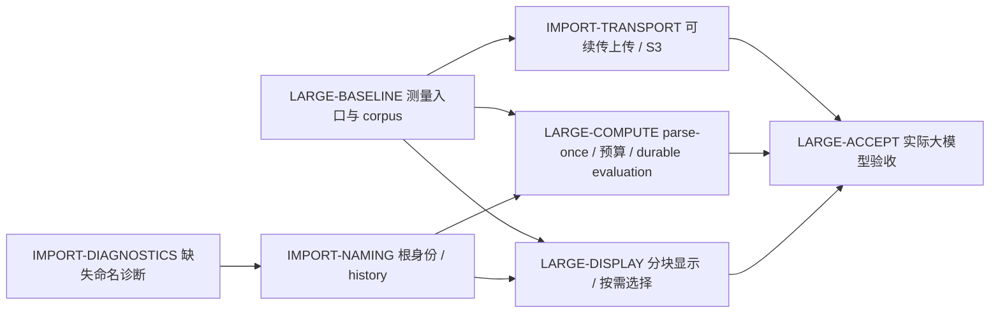

# 导入可编辑性与大模型支线

> 状态：待实施。2026-09-22 设计已整理，未实施或大文件验收。返回[统一路线](README.md)；唯一详细设计见[大文件导入与大模型工作集](../docs/architecture/target/large-models.md)，不在计划复制一套架构。

本轮用户优先项为此支线，原装配主线和 Feature/Projection 依赖保留。目标不是单独提高上传大小，而是让导入和原生大模型都具备可恢复、可编辑、受预算约束的完整链路。

若只有一条实施线：先 IMPORT-DIAGNOSTICS 与 LARGE-BASELINE，完成 IMPORT-NAMING 的小模型编辑闭环；随后 IMPORT-TRANSPORT → LARGE-COMPUTE → LARGE-DISPLAY，最终 LARGE-ACCEPT。测量和正确性测试贯穿各批次，不把测试留到最后。S3 不阻塞小导入模型的 naming 修复；显示制品外置的 RPC/manifest 合同要在 COMPUTE 和 DISPLAY 实施前共同冻结。

| 标识 | 实施范围 | 退出门 |
|---|---|---|
| IMPORT-DIAGNOSTICS | digest 可空读取；缺失/失败/损坏分流；按能力禁用依赖 naming 的操作；审计当前导入记录 | 新旧无 manifest 文档能打开；不再泄漏 scan NULL；缺失 manifest 不伪装解析成功；正常 native 功能回归 |
| LARGE-BASELINE | 阶段计时/RSS/临时盘/网格规模指标；真实/生成 corpus 和冷/热基准命令 | 能定位 API、Jobs、Worker、数据库、浏览器各阶段成本；当前 128/512 MiB 上限记为基线拒绝，不宣称压力测试成功 |
| IMPORT-NAMING | ImportDefinition/IdentityMap、初始 Face/Edge/Vertex manifest、base seed 传入布尔链、已有导入 Head 的显式修复 | 导入→六面草图/拉伸/切除→投影/装配→后续布尔→Undo/Redo/冷加载；对称歧义不误配；稳定 identity 不用 local ID 代替 |
| IMPORT-TRANSPORT | 上传会话、multipart 续传、可信摘要、S3 Store、短期授权、Worker staging、GC | 1/2 GiB 字节传输、断线/刷新/取消/重复 Complete/跨用户隔离；API 不缓冲整文件；LOCAL/S3 同一制品合同 |
| LARGE-COMPUTE | STEP parse-once、组件 checkpoint、小摘要响应、精确/显示分阶段、预算调度与进程隔离；原生长求值 Jobs | 不再每 root 重读源；无全量 mesh RPC/结果数组积压；OOM/取消/重领/CAS/隐藏候选发布；不超资源预算 |
| LARGE-DISPLAY | 轻量 DocumentView、表示 manifest、LOD/chunk、共享 buffers、Worker 解码/BVH、按需边点和局部交点 | 导入/原生同一加载链；LOD/淘汰不改选择身份；过时请求丢弃；指定硬件下首屏、交互及 CPU/GPU 预算通过 |
| LARGE-ACCEPT | 指定硬件上的真实 1 GiB+、单大 Body/大装配/原生大模型、并发和故障注入 | 发布可复现能力矩阵、已测上限与超限诊断；包含真实浏览器，不以 Node 或上传成功代替几何/WebGL 验收 |

完整 STEP XDE/AP242 层级、颜色与共享定义语义在 parse-once 后设独立 conformance 批次；第一轮可以保留现有展平交换合同，但不得靠把多根导入称作完整装配交换完成此项。

每批只更新实际完成事实；没有 naming 的导入不能因“能显示”标记为可编辑，没有 bounded visualization 的大文件不能因“上传成功”标记为大模型支持。Proto、数据库、稳定身份和历史变更按全局审查/验证边界执行；最终验收需真实大模型和浏览器，本次设计阶段不执行这些重测试。
