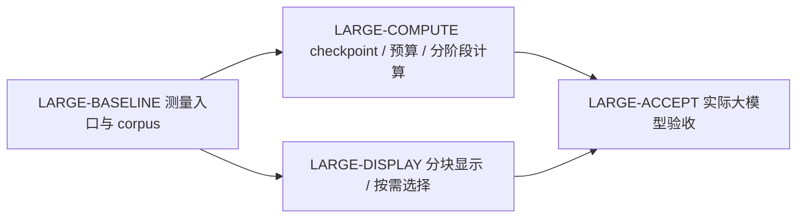

# 导入可编辑性与大模型支线

> 状态：待实施（剩余容量与验收批次）。IMPORT-DIAGNOSTICS 与 IMPORT-NAMING 基础整改已移出待办；当前 Jobs/导入链见[实现与验证入口](../docs/architecture/current/jobs-artifacts.md#实现与验证入口)，根命名证据见[导入命名](../docs/architecture/current/persistent-naming.md#导入根命名import-naming-已完成2026-09-22)。S3 存储基础、流式传输、Worker staging、制品外置及 XDE 共享定义与嵌套结构/parse-once/并行命名与阶段进度已实现，见[当前存储](../docs/architecture/current/jobs-artifacts.md#artifactstore)和[数据面](../docs/architecture/current/geometry-representations.md)。本阶段按用户要求不做续传；实际大模型几何/显示验收仍待实施。返回[统一路线](README.md)；唯一详细设计见[大文件导入与大模型工作集](../docs/architecture/target/large-models.md)，不在计划复制一套架构。

本支线保留独立队列，首项 LARGE-BASELINE；当前下一主任务是 CONSTRAINT-CONTRACT。只有明确的新需求才调整执行优先级。剩余目标是导入和原生大模型的 checkpoint、资源预算、分阶段计算与渐进显示，不重复实施数据面基础。

```mermaid
flowchart LR
    Baseline["LARGE-BASELINE 测量入口与 corpus"] --> Runtime["LARGE-COMPUTE checkpoint / 预算 / 分阶段计算"]
    Baseline --> Display["LARGE-DISPLAY 分块显示 / 按需选择"]
    Runtime --> Acceptance["LARGE-ACCEPT 实际大模型验收"]
    Display --> Acceptance
```

本支线领取顺序：LARGE-BASELINE → LARGE-COMPUTE → LARGE-DISPLAY → LARGE-ACCEPT。续传不在流程图或串行前置中；IMPORT-TRANSPORT 剩余项仅在新传输/部署需求明确后领取。测量和正确性测试贯穿各批次，复用已交付 Artifact/RPC/manifest 合同。

| 标识 | 实施范围 | 退出门 |
|---|---|---|
| LARGE-BASELINE | 阶段计时/RSS/临时盘/网格规模指标；真实/生成 corpus 和冷/热基准命令 | 能定位 API、Jobs、Worker、数据库、浏览器各阶段成本；记录配置的文件上限、临时盘和失败阶段，不宣称压力测试成功 |
| IMPORT-TRANSPORT（剩余，暂缓） | 需求触发后补上传会话、直传授权、GC 与跨主机 Worker 数据面；不阻塞当前容量支线 | 若启动，验收 1/2 GiB 字节传输、断线/刷新/取消/重复 Complete/跨用户隔离；API 不缓冲整文件；LOCAL/S3 同一制品合同 |
| LARGE-COMPUTE（剩余） | 已交付 parse-once、XDE Definition 图与有界并发；已交付小摘要响应与 BREP/GLB/Naming Artifact；剩余组件 checkpoint、精确/显示分阶段、预算调度与进程隔离；原生长求值 Jobs | 不再每 root 重读源；无全量 mesh RPC/结果数组积压；OOM/取消/重领/CAS/隐藏候选发布；不超资源预算 |
| LARGE-DISPLAY（剩余） | 已交付轻量 DocumentView 与统一 GLB 角色索引；剩余 LOD/chunk、共享 buffers、Worker 解码/BVH、按需边点和局部交点 | 导入/原生同一加载链；LOD/淘汰不改选择身份；过时请求丢弃；指定硬件下首屏、交互及 CPU/GPU 预算通过 |
| LARGE-ACCEPT | 指定硬件上的真实 1 GiB+、单大 Body/大装配/原生大模型、并发和故障注入 | 发布可复现能力矩阵、已测上限与超限诊断；包含真实浏览器，不以 Node 或上传成功代替几何/WebGL 验收 |

STEP/XDE 基础层级、共享 Definition、名称和 placement round-trip 已转入当前架构；剩余 AP242 批次扩展颜色、材质、层、PMI 与更广泛外部语料 conformance，不将基础装配交换称作完整 AP242。

一次真实文件导入变快不证明 1 GiB+、单超大 Body 或低复用大装配已验收；这些容量与 CPU/GPU/故障边界继续由 LARGE-BASELINE 和 LARGE-ACCEPT 的可复现记录决定。

每批只更新实际完成事实；没有 naming 的导入不能因“能显示”标记为可编辑，没有 bounded visualization 的大文件不能因“上传成功”标记为大模型支持。Proto、数据库、稳定身份和历史变更按全局审查/验证边界执行；最终验收需真实大模型和浏览器，本次命名任务未执行这些重测试。
