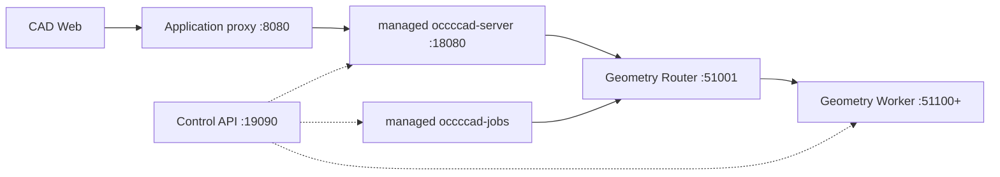

# occccad-control

occccad-control 是当前单机开发/调试控制进程。它负责把多个本地可执行文件组织成稳定入口，并实现最小 Geometry Router；它不是生产级 Kubernetes 控制平面。

## 管理的拓扑



## 当前职责

- 启动和停止 API、Jobs 与最小数量的 C++ Geometry Worker；
- 在稳定地址代理浏览器流量到托管 API 或外部调试 API；
- 实现 GeometryWorker gRPC 代理，按 resident geometry 和 in-flight 负载选 Worker；
- 容量不足且未达上限时拉起 Worker，空闲超时后缩容；
- 将相对 `OCCCCAD_DATA_DIR` 以 `services/` 为唯一基准解析成绝对路径，并传给 API、Jobs 与所有 Geometry Worker，保证本地 ArtifactReference 指向同一对象；
- Worker 失联后移除并维持最小副本数；
- 为 API、Jobs、Geometry 提供调试切流。

## 地址与配置

| 变量 | 默认值 | 说明 |
|---|---|---|
| `OCCCCAD_APP_LISTEN` | `0.0.0.0:8080` | 浏览器访问的稳定 HTTP 入口 |
| `OCCCCAD_CONTROL_LISTEN` | `127.0.0.1:19090` | 仅本机管理 API |
| `OCCCCAD_API_INTERNAL_LISTEN` | `127.0.0.1:18080` | 托管 API 内部地址 |
| `OCCCCAD_GEOMETRY_ROUTER_LISTEN` | `127.0.0.1:51001` | gRPC Router 地址 |
| `OCCCCAD_GEOMETRY_WORKER_FIRST_PORT` | `51100` | Worker 起始端口 |
| `OCCCCAD_GEOMETRY_WORKER_MIN` | `1` | 最小 Worker 数 |
| `OCCCCAD_GEOMETRY_WORKER_MAX` | `8` | 最大 Worker 数 |
| `OCCCCAD_GEOMETRY_PER_WORKER` | `2` | 每 Worker resident geometry 容量 |
| `OCCCCAD_GEOMETRY_WORKER_IDLE` | `5m` | 超出最小副本后的空闲回收时间 |
| `OCCCCAD_SERVER_BIN` | 构建目录中的二进制 | API 可执行文件覆盖 |
| `OCCCCAD_JOBS_BIN` | 构建目录中的二进制 | Jobs 可执行文件覆盖 |
| `OCCCCAD_GEOMETRY_WORKER_BIN` | CMake 构建产物 | Geometry Worker 覆盖 |
| `OCCCCAD_BUILD_TYPE` | `Debug` | 选择默认 Worker 构建目录 |

## Control API

管理接口只应绑定环回地址，没有认证，绝不能直接暴露到公网。

| 方法与路径 | 用途 |
|---|---|
| `GET /control/status` | 查看托管进程、Worker 池与调试覆盖 |
| `POST /control/debug/api` | 把应用代理切到请求指定的外部 API |
| `DELETE /control/debug/api` | 恢复托管 API |
| `POST /control/debug/geometry` | 把 Geometry Router 切到外部 Worker |
| `DELETE /control/debug/geometry` | 恢复托管 Worker 池 |
| `POST /control/debug/jobs` | 暂停托管 Jobs，便于独占调试 |
| `DELETE /control/debug/jobs` | 恢复托管 Jobs |

## 运行与边界

```bash
invoke run.app --build-type=Debug
```

当前未发布开发环境需要丢弃全部服务端数据并从空基线启动时：

```bash
invoke run.app --reset-data --build-type=Debug
```

重置会删除数据库中固定的 `occcad` schema 与 `OCCCCAD_DATA_DIR` 本地制品目录，再执行当前迁移。它要求旧的 occccad 进程已经停止，且不能用于已发布或需要保留外部数据的环境。

Router 的内存映射不持久化；重启后会重新发现计算结果。它只管理本机子进程，没有跨主机注册、认证、配额、租户隔离或 Kubernetes 集成。生产目标中的 Scheduler/Registry 不能把本进程原样搬进集群，演进方案见[目标架构](../../../docs/TARGET_ARCHITECTURE.md)。
