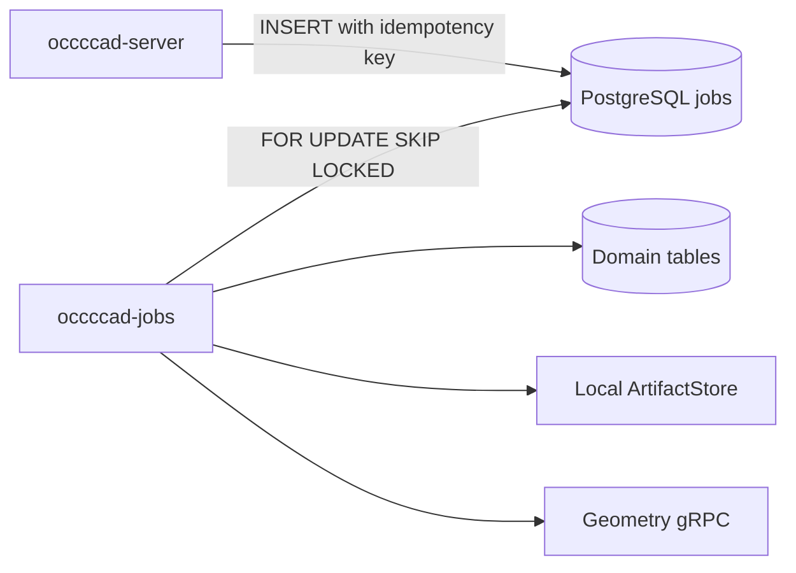

# occccad-jobs

occccad-jobs 是当前 PostgreSQL 持久任务的消费者进程，适合脱离 HTTP 请求执行可重试工作。

## 当前职责

| 任务类型 | 输入 | 输出/副作用 |
|---|---|---|
| `STEP_IMPORT` | ArtifactStore 中的 STEP 对象 | 调用 Geometry Worker，更新目标 Part，并触发预览 |
| `STEP_EXPORT` | 文档当前几何 | 生成 STEP，并把结果对象 ID 写回任务 |
| `THUMBNAIL_RENDER` | 文档与版本 | 生成 SVG 缩略图并更新 `document_previews` |

Worker 不提供网络 API，不接受用户认证请求，也不是通用分布式工作流引擎。

## 执行模型



- 任务使用租约领取，默认租约 2 分钟，每 30 秒续约；
- 进程崩溃后，租约过期的 `RUNNING` 任务可被其他 Worker 重新领取；
- 失败任务在达到最大次数前进入 `RETRY_WAIT`；
- 领取语义是至少一次，任务处理器必须依赖幂等键和条件写入，不能假设“恰好一次”；
- 轮询为空时等待 1 秒。

## 依赖和配置

依赖 PostgreSQL、与 API 相同的 ArtifactStore 根目录，以及可用的 Geometry gRPC 地址。使用与 [occccad-server](../occccad-server/README.md) 相同的数据库、`OCCCCAD_DATA_DIR`、`OCCCCAD_GEOMETRY_WORKER_ADDRESS` 和 OTLP 配置。

在多进程或多主机部署中，所有实例必须看到同一套对象存储。当前本地目录后端不满足跨主机共享要求，因此当前 Jobs 只适合与 API 共享文件系统的部署。

## 运行

```bash
invoke run.jobs
```

完整本地拓扑使用：

```bash
invoke run.app --build-type=Debug
```

## 失败处理

- STEP 任务提交后若文档 Head 已变化，任务失败，避免把旧输入覆盖到新版本；
- 过时的缩略图任务直接成功结束，不覆盖新版本预览；
- 不支持的任务类型会失败并按队列策略重试；
- 制品写入成功但数据库提交失败时可能留下未引用对象，未来对象存储 GC 必须按引用扫描清理。

## 扩缩容与验证

多个实例可以并行消费，`SKIP LOCKED` 防止同时领取同一行。扩容前要确认 Geometry Worker 与共享制品存储容量；当前没有按任务类型隔离队列，耗时 STEP 工作可能影响缩略图延迟。

```bash
cd services
go test ./...
```

当任务出现多阶段补偿、跨天计时、人工审批或复杂扇出时，再按[目标架构](../../../docs/TARGET_ARCHITECTURE.md)引入工作流引擎；不要因任务数量增加就立即替换当前简单队列。
