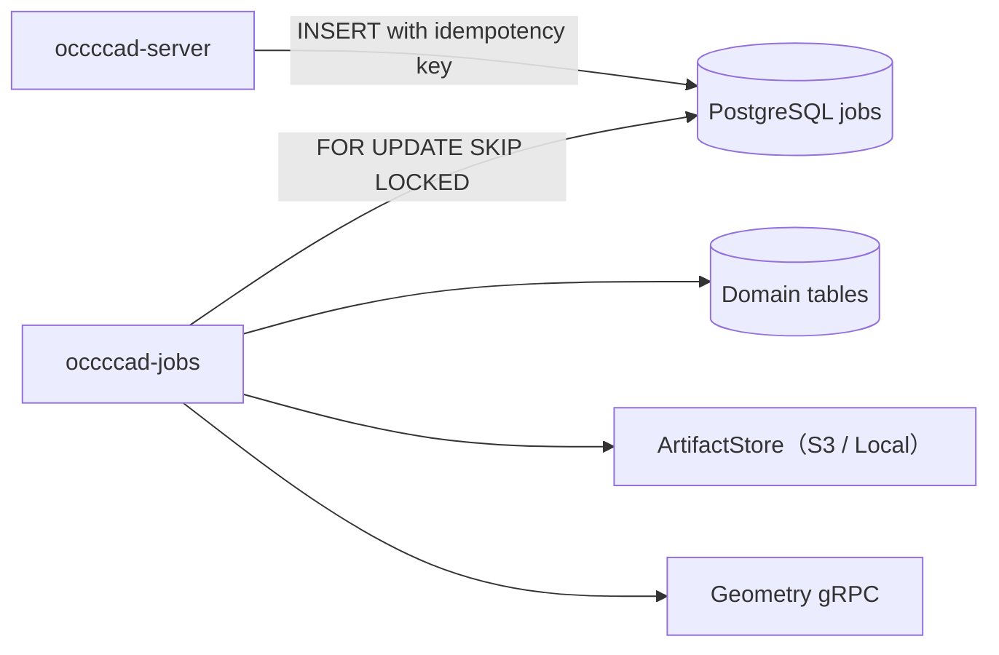

# occccad-jobs

occccad-jobs 是当前 PostgreSQL 持久任务的消费者进程，适合脱离 HTTP 请求执行可重试工作。

## 当前职责

| 任务类型 | 输入 | 输出/副作用 |
|---|---|---|
| `EXCHANGE_IMPORT` | ArtifactStore 中的 STEP/BREP 对象 | 一次解析 XDE Definition/Occurrence graph；唯一 Part 并行求值/命名，按依赖创建共享、嵌套 Product |
| `EXCHANGE_EXPORT` | Part 或 Product 当前 Head 的 B-Rep 引用 | 生成 STEP/BREP，并把结果对象 ID 写回任务 |
| `THUMBNAIL_RENDER` | 文档与版本 | 使用 `png-v4` 生成 `640×400` 正交等轴测 PNG 并更新 `document_previews` |

Worker 不提供网络 API，不接受用户认证请求，也不是通用分布式工作流引擎。
STEP 优先保留 Definition/Occurrence 名称；无源名称时使用上传文件名。Product STEP 导出通过 XDE 共享 Definition 和 reference + local placement，保留嵌套层级。BREP 保持单 Part/Compound 语义。

## 执行模型

单个进程默认同时运行 2 个独立 Job 领取循环，`OCCCCAD_JOB_CONCURRENCY` 可设为 1–8。每个循环持有独立 lease owner 和 Workspace 缓存；共享 PostgreSQL 池、ArtifactStore 与 Geometry Router，多个导入文件可由不同 Geometry Worker 进程处理。每个文件仍是独立可重试任务，批次中的一个失败不会撤销其他文件。



- 任务使用租约领取，默认租约 2 分钟，每 30 秒续约；
- 进程崩溃后，租约过期的 `RUNNING` 任务可被其他 Worker 重新领取；
- 暂态失败在达到最大次数前进入 `RETRY_WAIT`；导入域校验或 Worker `INVALID_ARGUMENT` 直接失败，避免确定性失败反复占用计算资源；
- 用户取消排队任务时立即进入 `CANCELED`；运行任务每秒观察取消请求、取消正在进行的 Geometry 调用并由当前 lease owner 确认终态；
- Worker 按持久阶段单调写入 0–100 进度；导入进入正式文档提交阶段后关闭取消能力，避免形成半提交的组件集合；
- 最终失败或取消任务可在同一 Job identity 上手动重试，继续递增 attempt，不覆盖尝试历史；
- 领取语义是至少一次，任务处理器必须依赖幂等键和条件写入，不能假设“恰好一次”；
- 最终成功、最终失败或取消与 `JOB` Outbox 在同一数据库 statement 中写入；API 通过 `job.state.changed.v1` 通知任务发起用户，重试等待状态不制造失败通知；
- 轮询为空时等待 1 秒。
- 缩略图生成默认有 `5s` deadline，可通过 `OCCCCAD_THUMBNAIL_RENDER_TIMEOUT` 调整；超时或场景预算耗尽会持久化固定尺寸默认 PNG。API 在预览尚未生成或制品不可用时也返回默认 PNG；父 Job 取消直接结束渲染，不遗留后台渲染 goroutine。
- `png-v4` 与视口共用 `(1,-1,1)` / Z-up 的正交 ISO 约定，按实际投影几何统一 Fit，应用 occurrence 完整 quaternion/translation。
- CPU 扫描线光栅化使用逐像素深度、面内平滑法线、固定中性材质和 2× 超采样；优先绘制 B-Rep 边并做深度测试，缺少边时提取轮廓/折线。实体缩略图不绘制草图编辑覆盖层；无实体时保留 Visualization 曲线/点/面。
- 不依赖浏览器、GPU 或新外部服务。每次渲染预算为 100 万展开三角形、300 万顶点/曲线点、1 万 occurrence；同场景相同 GeometryKey 复用法线准备结果。该边界只影响预览，不删除/简化权威模型。
- RendererVersion 是缓存身份的一部分；迁移 `0025` 将旧图标记 STALE 并为当前 Head 排队重建，不修改文档 Revision。旧版本渲染任务会被跳过。
- 就绪图像通过 `ETag` 和 `private, no-cache` 复用响应字节，每次重验证仍校验权限与当前 Head，包含 FOLLOW_HEAD 引用变化。
- 渲染器、数值/遮挡测试与基准位于 `internal/thumbnail`；设置 `OCCCCAD_THUMBNAIL_GALLERY=/tmp/occccad-thumbnail-v4` 后运行 `go test ./internal/thumbnail -run TestThumbnailGallery` 可导出视觉样例。

## 依赖和配置

依赖 PostgreSQL、与 API 相同的 ArtifactStore 配置，以及可用的 Geometry gRPC 地址。使用与 [occccad-server](../occccad-server/README.md) 相同的数据库、`OCCCCAD_DATA_DIR`、`OCCCCAD_GEOMETRY_WORKER_ADDRESS` 和 OTLP 配置。

持久文件支持 S3 和本地后端。当前 Geometry Worker 仍通过 LOCAL 暂存目录交付输出，因此 Jobs、Router 与 Worker 需要共享该暂存目录；S3 持久化不意味着 Worker 暂存已支持跨主机传递。

## 运行

```bash
invoke run.jobs
```

完整本地拓扑使用：

```bash
invoke run.app --build-type=Debug
```

## 失败处理

- Exchange 导出提交后若文档 Head 已变化，任务失败，避免混合不同版本；
- 过时的缩略图任务直接成功结束，不覆盖新版本预览；
- 不支持的任务类型会失败并按队列策略重试；
- 制品写入成功但数据库提交失败时可能留下未引用对象，未来对象存储 GC 必须按引用扫描清理。

## 扩缩容与验证

多个实例可以并行消费，`SKIP LOCKED` 防止同时领取同一行。源文件解析一次，按唯一 Part Definition 生成本地坐标快照；同一 Jobs 进程的所有导入共享最多 4 个并行工作额度（`OCCCCAD_IMPORT_CONCURRENCY`：正整数，默认 4），正式 Geometry Router 可把它们分配给不同 Worker；最终 Product 组装与交换文件写出仍是确定性的 reduce 阶段。扩容前要确认 Geometry Worker 与共享制品存储容量；当前没有按任务类型隔离队列，耗时交换工作可能影响缩略图延迟。

```bash
cd services
go test ./...
```

当任务出现多阶段补偿、跨天计时、人工审批或复杂扇出时，再按[目标架构](../../../docs/TARGET_ARCHITECTURE.md)引入工作流引擎；不要因任务数量增加就立即替换当前简单队列。

交换导入提交保留原始输入对象、摘要、格式和源 Definition ID，由 Workspace 冻结 ImportDefinition/拓扑身份并完成根命名求值，再提交普通 Part Revision。重试复用已采用的精确几何快照与身份分配，避免再次读取已移走的暂存制品。当前根命名范围为有效 Solid/Compound Definition；大文件传输与分块显示仍以独立计划为准。

Jobs 同样使用 [统一数据库访问层](../../internal/database/README.md)，本进程的任务循环共享有界数据库调度预算；该预算独立于 API 进程，配置连接上限时应计算两者总和。持久 Job 租约、重试和提交语义保持不变，调度等待不代表任务成功。

制品通过 `artifact.Store` 使用配置的 LOCAL/S3 后端。源文件输入经 Geometry client 下载到独立 Worker scratch，输出经 Adopt 上传后才提交业务引用。API、Jobs 与本机 Worker 仍共享计算暂存目录；[配置与迁移](../occccad-artifacts/README.md)。

## 唯一 Definition 求值与进度

`OCCCCAD_IMPORT_CONCURRENCY` 控制同一 Jobs 进程所有导入共享的最大活动工作数，默认 4、可设置任意正整数；每个文件的组件求值和 Part 创建按 `min(组件数, 配置上限)` 调度，准备解析也占用一个额度。空闲额度可由其他文件使用，等待可取消，失败自动释放；多个文件不会各自再获得一整套额度。额度限制活动计算，不限制已经驻留缓存的进程；Router 的 `OCCCCAD_GEOMETRY_WORKER_MAX` 才是所有操作共享的进程总数硬上限。若希望整个应用最多 8 个 Worker，设置两项为 8；多个独立 Jobs 进程各有导入额度，但仍受同一 Router 的总进程上限限制。输入只解析一次，每个唯一 Part Definition 生成本地坐标 BREP；有效性修复在 Worker 内并行执行。Occurrence 的名称和 placement 保存在实例中，不烘焙进 Part 几何；相同几何的不同 Definition 不合并业务文档。

进度显示解析拆分、组件求值、零件命名/创建、装配创建；已完成数量来自真实完成回调。70% 起进入文档提交区，保持原取消边界。重试/租约重领不清零总进度，新 attempt 显示实际阶段及尝试次数；每个阶段结束只记录一条包含耗时和组件数的日志。确定性校验失败不自动反复重跑。

完整导入的定向验证（独立测试账号和文件夹，结束移入回收站，不重置开发库）：

```sh
OCCCCAD_TEST_IMPORT_DATABASE=1 OCCCCAD_TEST_GEOMETRY_WORKER=/absolute/path/occccad_geometry_worker OCCCCAD_TEST_EXCHANGE_STEP='/absolute/path/LD200 torsen v7.step' go test ./cmd/occccad-jobs -run '^TestXdeImportSharedDefinitionsAndRoundTrip$' -count=1 -v -timeout 20m
```

测试检查源 Definition 数量、共享/嵌套引用、冻结命名、全部 Part 面绑定和进度单调性；保留命中去重的源对象，不删除业务共享制品。

Part 求值结果仅携带摘要和 BREP/VISUAL/NAMING 引用，导入 identity seed 另存 Artifact。缩略图通过 `HydrateDisplay` 读取与前端相同的 GLB，不读取数据库 Mesh；仅在渲染调用范围内解码，DocumentView 不包含完整网格。详见[几何表示](../../../docs/architecture/current/geometry-representations.md)。

不提供 STEP 样本、配置 `OCCCCAD_TEST_DATABASE_URL` 与 Worker 时，上述集成测试生成共享 100 次 Part、共享子装配及同形不同定义的 fixture，并验证导出重新导入；使用独立测试库。协议细节见[交换架构](../../../docs/architecture/current/jobs-artifacts.md)。
