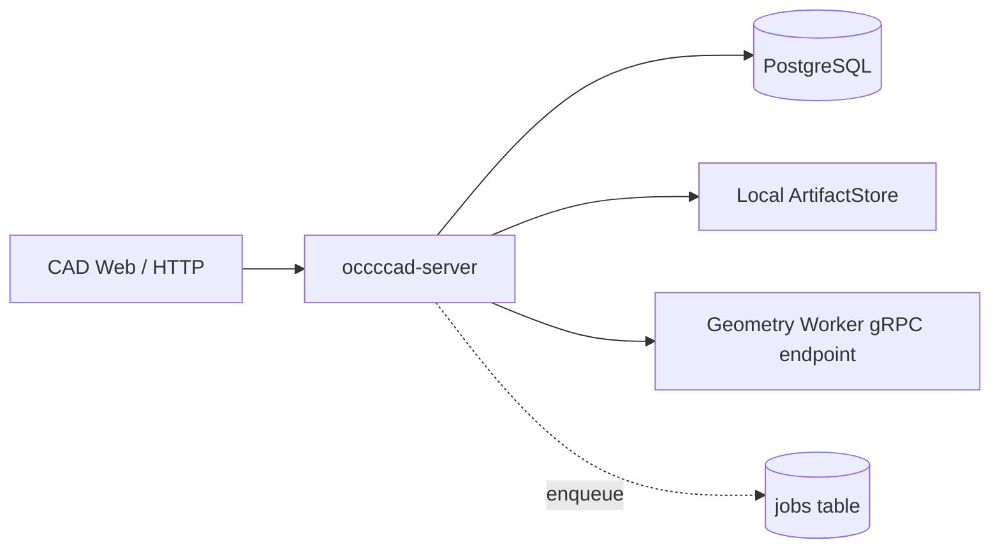

# occccad-server

occccad-server 是当前系统的 HTTP API 与业务编排进程。它是模块化单体，不是多个虚构微服务的集合。

## 当前职责

- 初始化管理员账号和数据库会话认证；
- 提供用户、团队、文档、文件夹、版本、历史、分享、ACL 与审计 API；
- 验证访问权限，把 HTTP transport DTO 转换为版本化 Domain Command，并由 typed handler 应用到显式 Part/Product Workspace；
- 在数据库事务外通过 gRPC 求值候选模型，再以 Workspace Head/sequence CAS 原子持久化 Transaction、ChangeSet、Revision、EvaluationManifest、依赖投影和 outbox；
- 把 STEP 和缩略图工作写入 PostgreSQL 持久任务队列；
- 通过 ArtifactStore 读写本地内容寻址制品；
- 暴露健康检查并传播 HTTP/gRPC Trace Context。

它不提供静态前端，不负责消费后台任务，也不直接执行 OCCT 几何算法。

## 依赖与调用关系



启动时会自动执行数据库迁移，并要求 Geometry gRPC 地址可连接。当前 ArtifactStore 固定为本地文件系统。

## 接口

- 默认监听：`0.0.0.0:8080`
- 健康检查：`GET /api/health`
- API 前缀：`/api/`
- 根路径返回服务说明，不提供 Web 静态文件。

主要资源包括 `/api/auth/*`、`/api/session`、`/api/documents`、`/api/folders`、`/api/jobs`、`/api/teams`、`/api/users`、`/api/admin/*` 与 `/api/audit`。具体契约当前以 `services/internal/api/server.go` 为准；仓库尚未发布稳定的外部 OpenAPI。

`GET|POST /api/documents/{documentID}/workspaces` 用于列出 Workspace 或从所属 Revision 创建 Branch。`POST /api/documents/{documentID}/commands` 是当前 HTTP transport 入口；`SET_PARAMETER_VALUE` 接受 `parameterId/value/unit`，`SET_PARAMETER_EXPRESSION` 接受 `parameterId/expression`。表达式在服务端绑定稳定 ParameterId，Worker 不解析用户 source text。

## 配置

| 变量 | 默认值 | 说明 |
|---|---|---|
| `OCCCCAD_DATABASE_URL` | 由 PostgreSQL 分项变量生成 | 完整连接串，优先级最高 |
| `OCCCCAD_POSTGRES_HOST` | `127.0.0.1` | PostgreSQL 主机 |
| `OCCCCAD_POSTGRES_PORT` | `5432` | PostgreSQL 端口 |
| `OCCCCAD_POSTGRES_USER` | `occccad` | 数据库用户 |
| `OCCCCAD_POSTGRES_PASSWORD` | 空 | 数据库密码 |
| `OCCCCAD_POSTGRES_DB` | `occccad` | 数据库名 |
| `OCCCCAD_SERVER_LISTEN` | `0.0.0.0:8080` | HTTP 监听地址 |
| `OCCCCAD_GEOMETRY_WORKER_ADDRESS` | `127.0.0.1:51001` | Geometry gRPC 地址，可指向 Router |
| `OCCCCAD_DATA_DIR` | `./data` | 本地制品根目录，相对启动目录 |
| `OCCCCAD_ADMIN_EMAIL` | `admin@occccad.local` | 初始管理员邮箱 |
| `OCCCCAD_ADMIN_DISPLAY_NAME` | `Administrator` | 初始管理员显示名 |
| `OCCCCAD_ADMIN_PASSWORD` | 无 | 首次及每次启动均必须非空；不会覆盖已有密码 |
| `OCCCCAD_SESSION_DURATION` | `12h` | 会话有效期 |
| `OCCCCAD_SECURE_COOKIES` | `false` | 生产 HTTPS 环境必须为 `true` |
| `OCCCCAD_ALLOWED_ORIGINS` | 空 | 逗号分隔的跨域 Origin；同源代理无需设置 |
| `OTEL_EXPORTER_OTLP_ENDPOINT` | 空 | OTLP 导出端点；为空时仍记录 Trace ID |

## 运行

在仓库根目录配置 `.env` 后：

```bash
invoke run.server
```

完整本地拓扑通常通过 `invoke run.app` 由 occccad-control 管理，此时 API 实际监听内部地址并由控制进程代理。

## 一致性与故障语义

- PostgreSQL 是业务真相；Geometry Worker 返回的是可重建的计算结果。
- 写操作经过身份和 ACL 校验；昂贵求值不占用数据库事务，最终提交以 Head CAS 防止迟到结果覆盖新 Revision。
- Undo/Redo/Restore 都追加 Transaction 与 Revision；Revert/Reapply 围绕稳定根 Transaction 折叠，支持连续多步 Undo/Redo。`canUndo/canRedo` 由同一 actor history fold 计算并返回 Web；字段 digest 或结构依赖不匹配时返回冲突。
- 当前是无生产数据的新项目阶段；C0–C4 schema 变更要求重建开发数据库，不提供旧 cursor/history adapter。
- 后台任务具有幂等键；API 返回任务后不保证任务已完成。
- HTTP 读写超时当前均为 30 秒，因此长操作应进入任务系统。
- 进程重启会丢失内存中的“已打开文档”注册表，但不会丢失持久文档。

## 验证与扩展边界

```bash
cd services
go test ./...
```

扩展业务能力优先增加 `services/internal` 模块，只有出现独立扩缩容、故障隔离、安全边界或发布节奏需求时才拆分网络服务。长期演进见项目[目标架构](../../../docs/TARGET_ARCHITECTURE.md)。
