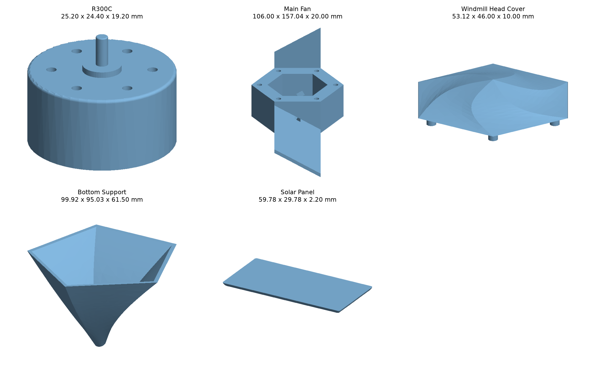
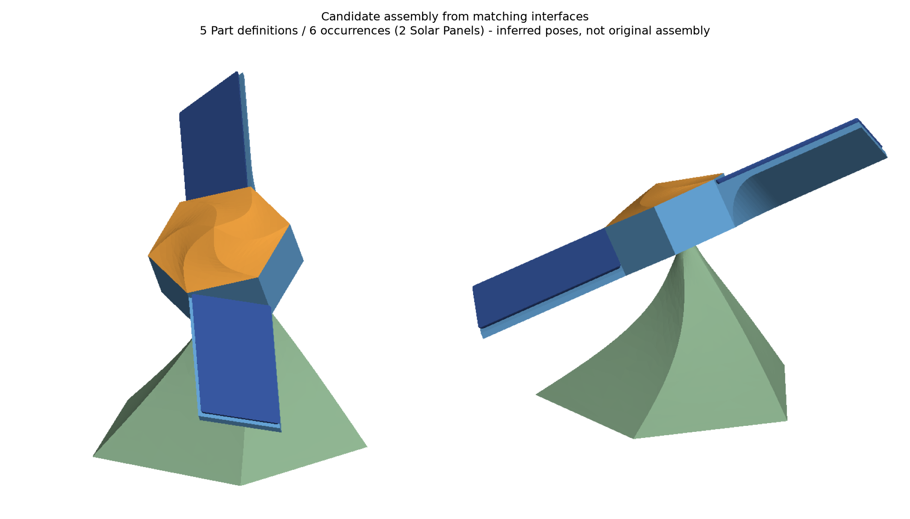

# 目标模型的参数化建模与装配验证分析

分析日期：2026-10-04。整理时仓库基线：`f0c4cfe`。

本文记录本目录五份 STEP 的只读几何分析、可能的参数化建模过程，以及 occccad 完成整体验证需要研究的算法与产品能力。它是目标数据分析，不是已实现能力声明或验收通过报告。

## 1. 目标与事实边界

维护者已确认最终验收采用：**参数化重建后的几何与装配关系等效，允许采用不同特征顺序。**

据此，将目标划分为：

1. 五类零件在软件内通过草图、参数和实体 Feature 重建。
2. 建立六个实例的候选静态装配，其中 Solar Panel 的同一零件定义复用两次。
3. 修改关键参数后，几何、拓扑引用、装配关系和显示结果按设计意图更新。
4. 保存重开、Undo/Redo、失败恢复及 Worker/制品链路保持一致。

输入 STEP 提供最终几何，不包含本次分析可用的原始草图约束、特征历史或装配约束。本文使用以下证据分类：

- **实测**：从输入文件读入的精确几何、解析曲面参数、尺寸、法向距离采样和候选姿态下的布尔交集结果。
- **候选**：根据实测几何反推的建模顺序、装配姿态和算法路线，尚未在产品建模链上实现或验收。
- **当前能力**：整理时依据仓库实现及当前架构核对的能力边界，不代表所有目标参数组合已经验证。
- **待验证**：几何重建精度、参数变化范围、真实命令链、交互、性能和运动语义。

本轮没有修改产品实现、执行数据重置、运行浏览器测试或全量单测。分析图使用独立离线离散与绘图生成，不能作为产品 GLB、选择映射或 WebGL 显示已通过的证据。

## 2. 输入数据与实测概况

五个文件均可由 OCCT 读入为有效的单 Solid。下表为读入并换算为毫米后的局部坐标包围尺寸，数值保留两位小数；它们不必等于原始草图的名义尺寸。

| 文件 | 包围尺寸 X × Y × Z（mm） | 读入后 Face 数 | 主要几何构成 |
|---|---:|---:|---|
| [R300C](<R300C - R300C.step>) | 25.20 × 24.40 × 19.20 | 28 | 平面、圆柱面、圆环面 |
| [Main Fan](<Main Fan - Main Fan.step>) | 106.00 × 157.04 × 20.00 | 54 | 39 个平面、15 个圆柱面 |
| [Solar Panel](<Solar Panel - Solar Panel.step>) | 59.78 × 29.78 × 2.20 | 10 | 2 个平面、4 个圆柱面、4 个 B-Spline 角部过渡面 |
| [Bottom Support](<Bottom Support - Bottom Support.step>) | 99.92 × 95.03 × 61.50 | 17 | 5 张外侧曲面、5 张内侧曲面及端部平面/圆柱面 |
| [Windmill Head Cover](<Windmill Head Cover - Windmill Head Cover.step>) | 53.12 × 46.00 × 10.00 | 19 | 6 张汇聚到顶点的曲面、底面和6个插柱 |



这些模型的几何复杂度主要来自局部构造与退化情形，而不是零件数量或面数。圆柱侧面的 R3、R15 表示倒圆角或等价圆弧构造；等距切斜面的倒角需要作为另一类特征处理。

## 3. 各零件的候选参数化建模过程

### 3.1 R300C：基础实体与安装接口基准

**实测特征**：主体直径 24.4 mm、主体至上安装面高度 12.5 mm；轴直径 2 mm；六个直径 1.7 mm 的盲孔位于半径 8.25 mm 的孔组圆周上；另有轴肩、定位凸耳以及半径 0.5/0.2 mm 的小圆角。

**候选顺序**：旋转截面或多级圆形拉伸构造主体、轴肩和轴 → 添加定位凸耳 → 切除安装孔 → 小圆角。

适合作为首个基准：核对圆、旋转/拉伸、孔组、参数表达式、实体命名和装配支持解析。孔组可先由同一草图中的多个圆及约束表达，专用圆周阵列不是这条路径的必要前置条件。

**边界**：参考文件中的轴与壳体属于同一个 Solid。它能作为静态装配的一个刚体，但没有表达电机内部转子与定子的相对运动。

### 3.2 Main Fan：斜面薄叶片与大圆弧叶根

**实测特征**：六边形外座对边 46 mm、内腔对边 30 mm、高 20 mm、腔底厚 2 mm；两片相对布置的叶片，主要支撑面倾斜 30°，相对上下平面的法向间距为 2 mm；叶根存在 R15 圆柱过渡；中心座有两组安装孔和局部槽口。

**候选顺序**：六边形拉伸与内腔切除 → 在倾斜基准上构造叶片及弧形叶根 → 构造第二片叶片 → 添加孔槽。

叶片主要由平面构成，可以优先研究含 R15 圆弧的二维截面，再拉伸并与轮毂组合、裁剪。这条路线可能减少“薄叶片完成后再施加大圆角”的难度，但必须比较根部圆柱、切向连接和最终裁剪边界。

两片叶片的参数应共享或由表达式关联。若先用两组显式特征完成，应验证修改角度、长度或根部半径后，两组定义不会失去对应关系。当前实体 Feature 目录没有专用镜像/阵列特征，不能将重复建模视为该能力已交付。

### 3.3 Solar Panel：圆角半径大于最终板厚

**实测特征**：最终厚度 2.2 mm，四个侧面为 R3 圆柱面，四角有独立 B-Spline 过渡面；底面矩形为 54 × 24 mm。

**候选顺序**：较厚毛坯 → 圆角与角部过渡 → 裁切至 2.2 mm 最终厚度。

允许不同特征顺序后，这条路径值得优先研究。参考几何明确要求支持 R3 大于最终厚度 2.2 mm 的结果，不能仅根据半径和板厚的比较判为非法。

仍需确认毛坯尺寸、角部处理和裁切位置。匹配四个侧面的半径不代表四角已经等效，不能把上述顺序写成已证明可重建的配方。

### 3.4 Bottom Support：受控曲面放样、恒定壁厚和内部加强

**实测特征**：大端为五边形开口，小端为直径 8 mm 的圆形端面，两端平面夹角 30°；侧面沿高度有明显弯曲过渡。内部存在直径 6 mm 的凸台，以及从小端外面进入的直径 2 mm、深 3.5 mm 盲孔。

对五张外侧曲面分别取 25 个内部参数域采样点，沿朝内法向与内侧曲面求交，得到：

| 外侧曲面诊断序号 | 有效采样数 | 法向距离范围（mm） |
|---|---:|---:|
| 2 | 25 | 1.99924–2.00051 |
| 3 | 25 | 1.99947–2.00078 |
| 4 | 25 | 1.99956–2.00108 |
| 5 | 25 | 1.99947–2.00078 |
| 6 | 25 | 1.99924–2.00051 |

125 个采样值的中位数为 2.00013 mm，支持**名义壁厚 2 mm**的判断。这里的序号仅用于本次离线诊断，不是持久拓扑身份。采样不构成全域壁厚、边界附近无自交或最小厚度的证明。

沿小圆端朝内方向，内底面、盲孔底面和内部凸台顶面距外端面的距离分别为 2、3.5、5.5 mm；直径 6 mm 的圆柱面的材料朝向也支持“内部凸台”的判断。

**候选顺序**：

1. 建立五边形大端、倾斜小圆端及必要的中间控制截面。
2. 构造与参考外形等效的曲面实体。
3. 移除大端面，向内抽壳 2 mm。
4. 在内部底部添加直径 6 mm 的加强凸台。
5. 从小端外面切除直径 2 mm、深 3.5 mm 的盲孔。

先抽壳、再做局部加强和钻孔，有机会减少偏移时需要处理的复杂边界。侧面弯曲意味着不能直接假定仅用五边形和圆两个截面就能得到目标外形；需要单独研究中间截面、端部方向或导引控制。

### 3.5 Windmill Head Cover：带扭转的点端放样

**实测特征**：底面为对边 46 mm 的六边形；六张曲面汇聚到高 7 mm 的同一顶点，边界路径带扭转；底部有六个直径 3 mm、长 3 mm 的插柱。

**候选顺序**：六边形底部截面 → 中间控制截面及明确对应关系 → 收敛到顶点的放样 → 插柱。

普通锥体或旋转体不能直接替代该目标。点端放样解决“收敛到一点”，还需要控制曲面和扭转才能匹配参考形状。尖端的退化边、法线和多面交汇也必须进入命名及可视化验证。

## 4. 算法问题与可尝试方向

### 4.1 大圆角：支撑面延伸、角区连接与最终裁剪

目标同时包含 Solar Panel 的 R3/厚2.2，以及 Main Fan 的 R15/薄叶片连接。圆角构造可能消耗旧边、延伸支撑面并重建角区，不能只检查算法的成功标志。

建议保留两条路线：

- **建模路线优化**：用圆弧截面、较厚毛坯和后续裁剪形成等效结果，先验证最小且稳定的参数化路径。
- **通用圆角能力**：研究相邻圆角交汇、支撑面延伸、角部补面、修剪及真实拓扑历史。用目标的角区作为验证对象，避免只扩充长方体上的特例。

OCCT 官方列出了圆角与限制面求交超出面域等构造限制，参见 [BRepFilletAPI_MakeFillet](https://occt3d.com/dev/doc/refman/html/class_b_rep_fillet_a_p_i___make_fillet.html)。

### 4.2 放样：形状控制、点截面与参数依赖

当前 [实体 Feature 合同](../../docs/architecture/current/solid-features.md) 和 [OCCT 实现](../../kernel/occt/src/occt_kernel.cpp) 主要提供有序闭合截面、方向和闭合起点；点截面、导轨及端部切向条件不是当前完整产品能力。`LoftSectionSpec` 和 `make_loft_tool` 应作为后续核对入口。

下一步优先评估：

- 不平行截面的定位、倾角、高度与参数依赖。
- 不同边数截面的对应关系及编辑后的稳定性。
- 少量有设计含义的中间截面对参考外形的表达能力。
- 首端/末端点截面，以及顶点附近的退化拓扑处理。
- 明确的扭转方向和闭合起点；参数变化时不自动换接另一条边。

OCCT 提供首端或末端 `AddVertex`，可作为点截面的候选入口，但需要补齐产品定义、Worker 输入、实际生成历史和前端操作链，参见 [BRepOffsetAPI_ThruSections](https://occt3d.com/dev/doc/refman/html/class_b_rep_offset_a_p_i___thru_sections.html)。若少量截面与明确对应仍不足以控制形状，再评估导轨和端部切向条件。

当前偏置基准面保存明确框架，尚无完整关联偏置参数编辑能力。整体验证要求高度、倾角等参数变化能驱动截面位置，不能只在创建时记录固定坐标。

### 4.3 抽壳：真实偏移与内壳重建

当前路径包含通用整体偏移、开口壳简化偏移，以及独立面厚度层与原实体的分区组装。此前的矩形到圆问题模型已出现混合连续性拒绝、容差超限和空组装结果；这些证据不能直接解释本目录底座会在哪一步失败，本底座的重建与抽壳仍需单独验证。

建议依次研究：

1. 先证明外形放样满足参考要求，再研究抽壳，避免混淆两类误差。
2. 将失败缩小到具体的相邻偏移面，分别检查交线、裁剪环、近相切区域和实体分类。
3. 评估连接性质变化处的局部分割，保留精确曲面及实际分割历史；不能简单绕过混合连续性检查。
4. 比较“偏移面求交裁剪 → 内壳 → 开口连接”的构造路径，评估能否减少薄壁实体反复布尔组装的问题。
5. 用最小复现评估 OCCT 定向修补或版本差异；没有目标回归证据前，不把升级视为解决方案。

“双放样相减”可以作为几何对照或另一种参数化建模路径。但若参数承诺为恒定壁厚，内腔仍需受真实偏移约束，不能仅缩小截面尺寸。参考 STEP 的转换/表示误差和重建算法误差应分别考虑，不能通过放宽容差掩盖缺壁或错误连接。

正确性先于性能。先确认完整壁面、开口和局部厚度，再依据偏移、求交、组装、命名和离散的分段测量优化。前一次问题模型的耗时不代表本底座的重建性能；本轮未测量目标重建速度。

### 4.4 拓扑身份、显示与失败恢复

大圆角、抽壳和点端放样都会产生分裂、合并、消失或退化拓扑，必须与参数重算同步验证：

- 持久选择来自稳定业务来源及实际生成历史，不保存诊断序号或用最近几何自动补配。
- 装配优先引用设计基准、安装轴面或 Publication，降低对后续局部修饰产生的小边面的依赖。
- 精确几何、Naming 和可视化快照一起切换；曲面边界、点端退化边、法线与拾取身份保持一致。
- 失败时明确区分当前失败模型和上次成功显示，不让旧显示实体成为新计算或装配支持的权威输入。

相关事实入口：[持久命名](../../docs/architecture/current/persistent-naming.md)、[几何制品](../../docs/architecture/current/geometry-representations.md)、[实体 Feature 失败语义](../../docs/architecture/current/solid-features.md)。

## 5. 候选装配与产品边界

根据安装孔、圆柱轴和接触面，可以推定如下静态方案：

- Bottom Support 固定。
- R300C 位于 Main Fan 的中心腔内，轴伸向底座小端孔。
- Windmill Head Cover 的六个插柱与 Main Fan 的六个盲孔对应。
- Solar Panel 的同一 Part 定义创建两个 occurrence，分别安装在两片叶片上。



在该候选姿态下，15 组零件两两布尔交集的重叠体积均测得为 0。布尔运算和距离查询检查了算法完成状态。关键接口证据如下：

| 接口 | 几何证据或候选姿态下的测量 |
|---|---|
| 顶盖—风扇 | 六个 Ø3、长3插柱对应六个 Ø3、深3盲孔；局部相位差30°；最小距离0 |
| 电机—风扇 | 安装孔组位置对应；Ø6.45轴肩与Ø6.5中心孔存在名义径向间隙0.025；候选安装面距离0 |
| 电机—底座 | Ø2轴与Ø2小端盲孔对应；候选接触距离在数值精度内为0 |
| 面板—叶片 | 两个实例分别与叶片支撑平面接触，距离在数值精度内为0 |
| 风扇—底座 | 本候选姿态下最小距离0.5 mm |
| 顶盖—面板 | 本候选姿态下两侧最小距离均约0.900924 mm |

这些结果只证明存在一套无测得实体穿透的静态候选，不证明原始设计意图、制造配合、运动扫掠或产品装配求解链已经通过。等径接口的名义接触也不代表已规定制造公差。

### 5.1 约束组织建议

当前 [Product 合同](../../docs/architecture/current/product-assembly.md) 和 [装配约束合同](../../docs/architecture/current/assembly-constraints.md) 已有轴、平面、角度、偏移和固定关系的基础。该目标优先检验这些关系与参数化零件更新的衔接：

- 用中心轴、安装面和一个定位方向建立充分关系，避免将六组孔全部重复设为驱动约束。
- 六孔组存在多个等效角度分支，需要保存明确相位，重算和拖拽不应跳到另一分支。
- 两块太阳能板共享定义，位姿、选择路径和装配关系分别属于各自 occurrence。
- 约束作用于解析支撑时，另行检查有限零件的实际位置和实体干涉；数学平面重合本身不保证面板仍位于叶片范围内。
- 零件重算导致支持消失时，明确报告引用失败，不能静默绑定另一条相似边。

### 5.2 静态装配与运动验收分开

本次候选采用六个刚体。R300C 的轴与壳体是同一整体，输入文件未定义内部转动副。若后续要求风扇转动演示，应先明确固定外壳、转轴及旋转组件的归属，必要时调整零件定义；不能从当前 STEP 推断内部运动已经表达。

### 5.3 候选姿态的复核约定

为便于后续独立复核，以下给出离线分析使用的一个确定姿态。坐标以原始 Main Fan 的局部框架为参照，旋转采用右手规则，列向量满足 `p' = R p + t`，长度为毫米。

| 实例 | 旋转 R | 平移 t |
|---|---|---|
| Main Fan | 单位旋转 | `(0, 0, 0)` |
| R300C | 绕X轴180° | `(0, 0, 14.5)` |
| Windmill Head Cover | 绕Z轴30° | `(0, 0, 20)` |
| Bottom Support | 绕X轴150° | `(0, 0, -9.160254037844386)` |

两个面板分别取 `s = +1` 和 `s = -1`。局部坐标轴在 Main Fan 框架中定义为：

```text
u = (-s/2, s*sqrt(3)/2, 0)
n = (-s*sqrt(3)/4, -s/4, sqrt(3)/2)
v = n × u
R = [u v n]                         # 三个列向量
t = 53*u - 4.988033871711837*v + 8.639528095676503*n
```

装配示意图对全部实例再施加相同的刚体变换，将底座大端放在水平地面：`R_g = R_x(30°)`，`t_g = (0,0,52) - R_g*(0,0,-9.160254037844386)`。该变换不改变两两间距或交集体积。

这些数值是分析候选，不应代替产品中的正式装配约束或成为持久业务身份。

## 6. 整体验证的验收层次

| 层次 | 必须证明的内容 |
|---|---|
| 名义几何等效 | 解析尺寸、曲面双向距离、断面、开口、壁厚和材料分布满足约定误差；不要求重建结果的面数、边数与STEP完全相同 |
| 参数化有效 | 修改板厚、圆角半径、底座高度/倾角/壁厚、叶片角度后，模型按设计意图重算；参数有效范围与不可行情形明确 |
| 装配持续有效 | 参数更新后安装关系正确、相位稳定、共享定义与实例不串位；引用失败有明确诊断 |
| 产品链路完整 | 正式命令、Worker、Naming、BREP/GLB、保存重开、Undo/Redo、拾取与显示消费同一结果 |

参考 STEP 的自由曲面存在表示误差，本次壁厚采样已呈现约千分之一毫米量级的偏差。应分别约定解析配合尺寸与自由曲面的比较容差，不能要求二进制或逐面拓扑相同，也不能用显示网格精度代替精确几何验收。

参数验证应包含名义值、邻近扰动、合理边界和明确不可行输入。仅在一个固定参数点上匹配参考模型，不足以证明参数化建模有效。

## 7. 建议研究顺序

1. **基础基准**：用 R300C 和 Main Fan 的基础座体，建立参数、尺寸、命名及安装接口的核对流程。
2. **大圆角**：优先研究 Solar Panel 的圆角后裁切与角区等效；用 Main Fan 的弧形叶根对照薄片后圆角路径。
3. **底座外形**：先确定能控制曲面形状的截面与对应关系，再进入名义2 mm抽壳。
4. **底座抽壳**：对偏移、求交、裁剪和组装分别建立最小复现，成功后添加内部凸台和盲孔。
5. **顶盖放样**：补充点端表达，研究扭转控制及尖端拓扑/显示。
6. **整体验证**：完成五类零件、六实例装配和参数修改后的完整更新链，再分别记录人工交互与性能验收。

上述顺序是建议，不是开发已启动或能力已完成的声明。本轮没有通过软件正式命令重建五类目标零件，没有通过产品装配求解器验收该候选，也没有进行运动、制造或工业容量验收。

## 附录：输入文件指纹

输入变化后，应重新检查相关测量、建模推断和候选装配，不沿用旧结论。

```text
122124d65c456c8bf63336d1455f928a5351e456890798f878e8f1f7b8504d6f  Bottom Support - Bottom Support.step
acba698d4971db25d32a8395eeeaac2129f570035701f4375079ec185c9954c7  Main Fan - Main Fan.step
040a971d8b832f565c37991d8c6e131a735068cee7cb927293b984b8ef6c6d91  R300C - R300C.step
6d53d886c52591ee5fc0c64065d3f36338904f196b788b6e00c8cbaed98a1282  Solar Panel - Solar Panel.step
03d32c103397ad32a4d250e2fb667558df9f83fcd713d037df1c199909a36121  Windmill Head Cover - Windmill Head Cover.step
```
