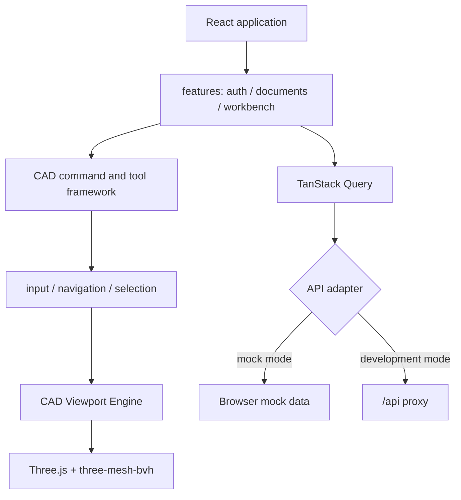

# CAD Web

CAD Web 是 occccad 的独立 React 应用，包含文档中心与浏览器 CAD 工作台。它可以连接真实 API，也可以用 Mock Adapter 单独开发。

## 当前能力

- 登录、注册、账号管理、文档/文件夹中心、分享与常驻消息中心；消息中心恢复用户可见任务，展示进度和失败原因，并提供取消、重试、下载或打开文档动作；
- Part/Product 多标签工作台、Specification Tree、Toolbar、Inspector；
- Three.js 精确网格显示、基准面、选择/预选与结构树联动；Specification Tree 展开草图几何与约束，按服务端 capability 提供删除，实体删除原子级联其引用约束；
- 草图绘制几何/约束/常用图形三组 Toolbar；Point、Line、Circle、Arc、Polyline、Spline、Rectangle、正六边形、长圆槽以及基础几何/尺寸约束；单击执行一次后回到选择，双击连续执行；
- 通用闭合 Profile（包含外环、孔和岛）拉伸、实例插入/移动、Undo/Redo；
- Default/CATIA 导航 Profile、Pointer Capture、快捷键上下文和 Overlay；
- 统一 CAD 语义色与 hover/selected/snap 层次；草图创建支持原点、点/端点、中点、线投影和 10 mm 网格吸附；
- Pad、Insert、命名版本使用可拖动非模态命令面板；Pad 数值 blur/Enter 后请求后端复用正式 typed command、Sketch Solver 与 Part evaluator 生成非持久化精确预览，提交才创建 Revision；
- 草图原点和 H/V 基准轴是自动带入、可约束选择的稳定内在引用；第一次约束选择与第二候选同时高亮，点、端点、捕获点和拓扑顶点统一显示为 X 形；
- TanStack Query 管理服务端状态，Zustand 管理工作台交互状态；
- Mock Adapter，以及真实 REST + WebSocket 双平面 Adapter；
- 工作台通过 `occccad.realtime.v1` 订阅文档，建模命令走关联请求响应，其他浏览器提交后由 Outbox event 触发权威状态刷新；
- WebSocket 自动心跳、指数退避重连、重新订阅、sequence 去重/gap 恢复和事件确认。
- `features/activity` 把后端来源投影成统一 ActivityItem；当前接入持久 Job，只有存在活动任务时才低频刷新进度，未来通知来源通过独立 projector 扩展。

浏览器只负责交互和显示，不执行可信 B-Rep 运算，也不成为文档的权威存储。

## 结构



页面与功能层不得直接操作 Three.js Scene、Renderer 或 Controls；渲染资源通过 CAD Viewport Engine 管理。输入统一经过 CadInput/CadInteraction，避免每个工具自行注册全局事件。

## 依赖基线

当前使用 React 19、TypeScript 5.9、Vite 8、Ant Design 6、React Router 7、TanStack Query 5、Zustand 5、Three.js 0.179 和 three-mesh-bvh。准确范围以本目录 `package.json` 和锁文件为准。

## 运行

从仓库根目录：

```bash
# 无后端，默认 Mock Adapter
invoke run.web

# /api 代理到真实后端
invoke run.web --mode=api
```

或在 `web/` 目录：

```bash
pnpm install --frozen-lockfile
pnpm dev:mock
pnpm dev:api
```

默认开发地址为 `http://localhost:5173`。真实 API 模式的代理目标由 Vite 配置读取，当前默认指向本地应用入口。

## 验证

```bash
invoke web.build
invoke test --build-type=Debug
```

`invoke web.build` 执行 TypeScript 类型检查和生产构建。Front 单元/交互状态机测试源集中在根目录 `tests/front`，由统一 `invoke test` 入口运行；当前仍没有完整的浏览器/WebGL Playwright 套件，复杂跨层交互在扩展前应补充组件和 Playwright 场景。

## 性能与安全边界

- 不为 Product 中每个实例重复下载相同 GeometryId 的 GLB；几何资源应去重并实例化渲染；
- 大装配需要渐进加载、LOD、可见性裁剪和批量拾取，不能一次构造完整 DOM/Scene；
- 任何客户端权限判断都只是体验优化，服务端必须再次鉴权；
- GLB/拓扑映射是显示制品，可以淘汰并重建；参数文档才是业务真相；
- WebGPU 可作为加速路径，但在兼容性与拾取语义成熟前保留 WebGL2/Three.js 基线。

长期前端数据流、实时协作和大装配方案见项目[目标架构](../../../docs/TARGET_ARCHITECTURE.md)。
