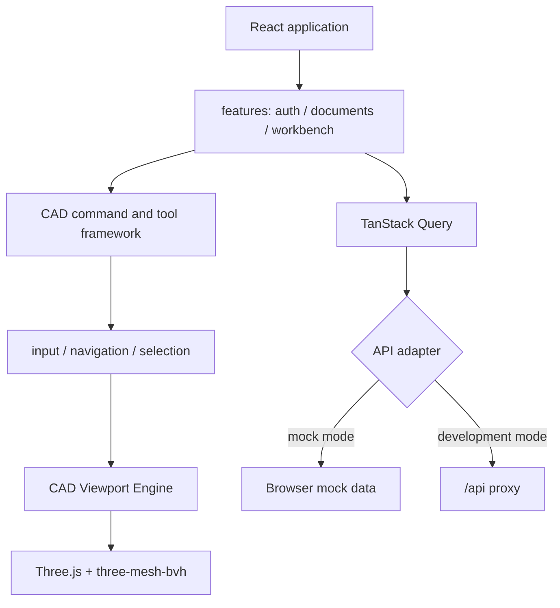

# CAD Web

CAD Web 是 occccad 的独立 React 应用，包含文档中心与浏览器 CAD 工作台。它可以连接真实 API，也可以用 Mock Adapter 单独开发。

## 当前能力

- 登录、注册、账号管理、文档/文件夹中心、分享与常驻消息中心；Document 使用 UUID 身份并允许显示名称重复，创建时提供可编辑的 `PartN`/`ProductN` 默认名称；消息中心恢复用户可见任务，展示进度和失败原因，并提供取消、重试、下载或打开文档动作；
- Part/Product 常驻文档标签、按上下文分组的图文命令区、可筛选的 Specification Tree、独立 WebGL 视口与可折叠 Inspector；
- Product 打开时默认激活根 occurrence；双击树中的 Product/Part/Instance 激活 typed InstancePath，并在保留根装配和其他部件的场景中就地编辑对应 Reference。视口 breadcrumb 明确显示上下文，可在 `打开定义` 与 `在此上下文打开` 间切换而不产生 Revision。Toolbar、属性、历史和命令绑定 Reference Document，草图与预览应用 occurrence 世界 Placement。Product 节点右键“新建零件”可留空自动分配 `PartN`，并以一个 ProductDesignTransaction 原子创建 Part、按 `PartN.N` 插入 occurrence、推进嵌套祖先引用；默认放在所选 Product 原点。Undo 移除 occurrence 但保留独立 Part 文档。Insert 仍用于插入已有 Reference；默认 `FOLLOW_HEAD` 子文档通过递归实时订阅发现变化并刷新 Product Update Plan，不会静默接受 Head。用户显式“接受全部更新”后才以 plan digest 提交；嵌套定义按叶到根处理；
- 命令组成、工作台归属、顺序、短名称与详细帮助由后端 Presentation Catalog 下发；命令区按建模/草图/装配、视图、文档与协作分类，撤销/重做和视图操作保留快捷入口；工具搜索包含当前工作台的已注册可见命令，不可用项可发现但不能执行；hover 使用统一深色提示显示命令名与已分配的快捷键，上边栏纯图标“这是什么？”进入一次性上下文帮助且不会触发命令，未知命令默认不显示且不可执行；
- Three.js 精确网格显示、基准面、集合化选择/预选与结构树联动；最终 Body 的视口选择归属最近的 Import/Extrude 节点，精确拓扑元素使用遮挡可见的面、宽边线和点 Overlay，树选父节点才展开全部后代；Specification Tree 支持 Ctrl/Meta 多选、Shift 连选和固定宽度的节点锚定右键菜单，选择变化关闭菜单，删除不确认并以一个原子 Revision 作用于当前选择集合，实体删除仍级联其引用约束；
- 草图基本元素、轮廓、几何约束和尺寸约束使用独立命令分组；Point、Line、Circle、Arc、Polyline、Spline、Rectangle、正六边形、长圆槽以及基础几何/尺寸约束；单击执行一次后回到选择，双击连续执行；
- Distance/Length/Radius/Diameter/Angle 驱动尺寸在属性面板显示稳定 ParameterId、可读别名、literal/expression 与计算值；Part Design 的“参数”面板集中列出并编辑当前文档的全部参数。新建线性拉伸可输入带单位长度、参数别名或表达式，也可从已有长度参数中直接选择；服务端在同一个创建事务中把表达式 AST 绑定 stable ID，因此重命名不会断开引用；
- Part Design 的“发布”面板创建和删除 Datum、Face/Edge、Body 与 Parameter Publication；结构树以稳定 PublicationId 显示接口，选中时仍使用实际 target 的视口选择身份定位，并在 Inspector 展示合同、resolved Revision、source digest 与 `BROKEN_PUBLICATION` 诊断。Publication 名称可直接编辑，稳定 ID 不变；参数面板可把本地参数发布。在 Product 中激活 Part 后，外部参数与其他输入通过当前 root snapshot 的可读 Context Catalog 按 occurrence breadcrumb/发布名称选择，不浏览所有文档也不手填 ID；
- Assembly Design 可直接选择子 Part Publication 建立约束，并通过“发布”面板沿嵌套 occurrence path 转发为 Product Publication；兼容 Replace/Update 重连新 target，不兼容合同显示 Broken。Part 在发布面板中声明 typed ContextInput，root Product 拥有 ContextBinding；创建绑定以一个多 Workspace transaction 原子更新消费 Part、嵌套 owning Product 链和 root Product，Undo/Redo 同样按事务组执行。P9 ContextReference 只作为旧试点/独立外部引用能力保留，不与 Product binding 双写；
- Product 顶部显示显式 Update Plan，分别呈现引用连接、版本新旧和候选求值是否成功；同输入的共享 Part occurrence 复用 Context Variant 制品。`Product Release` 面板只在 CURRENT/READY/VERIFIED/SolveManifest gates 全部通过时冻结 dependency closure，并可对旧 Release 执行 replay 或提交 STEP/BREP 导出；
- “开始草图”可直接使用 DatumPlane 或稳定平面 Face。Face 选择只把当前 Revision 的 raw pick 作为绑定证据，返回的 Sketch 显示 PLANAR_FACE semantic anchor、support snapshot 与失败诊断；面支撑失败不会静默切回 XY；
- Sketcher 采用 in-context 场景分层：当前权威 Body 始终以原实体材质和独立常亮光照作为只读背景显示，活动 Sketch/Grid/Constraint 作为前景 overlay；全部 Sketch 始终进入渲染树，由“未消费默认显示、已消费默认隐藏、持久用户覆盖、编辑态临时显示”的统一策略决定可见性，结构树菜单显示同一有效状态。普通草图工具仍只能编辑活动 Sketch 元素，显式“投影”工具才把 Body Edge/Vertex 绑定为独立 ExternalGeometry；
- ExternalGeometry 使用稳定 ExternalId、PersistentSelection、权威二维快照与 source digest；投影线/完整圆/点可参加草图约束但不能拖动或冒充普通 Entity。活动 Sketch 曲线使用屏幕稳定宽度的遮挡可见 overlay，ExternalGeometry 使用更宽的青色虚线，因此与 Body Edge 重合时仍可辨识。结构树提供“断开并冻结”和 Reconnect，属性面板显示 semantic anchor、解析状态、诊断与受影响对象；新建或重连投影若返回稳定不支持/退化诊断，命令失败且保留原 Head，不会留下空投影节点；
- 通用闭合 Profile（包含外环、孔和岛）拉伸、实例插入/移动、Undo/Redo；装配移动手柄从 Instance 的原始射线命中取得锚点和局部框架，平面法向对齐 Z、直线边切向对齐 X，中心再次吸附时同步更新位置和方向，并继续复用权威 `MOVE_INSTANCE` 预览/提交；
- 动态 Instance Placement 通过统一的可中断 transition 层显示：连续 MOVE 与手柄同步插值、装配约束预览平滑 settle、取消 rollback，提交或 Realtime 刷新按稳定 InstanceId 接续重建前的渲染姿态；直接指针输入和 reduced-motion 不增加动画延迟；
- Default/CATIA 导航 Profile、Pointer Capture、Tool 手势状态机和 Overlay；Default 右键旋转在每次手势开始时以全部可见内容的最小包围盒中心为基准，若指针直接命中拓扑点则仅为当前手势使用该点；快捷键经统一 CommandRegistry 执行并遵循命令可用性；输入框、输入法组合输入及打开的命令面板不触发全局快捷键，Enter/Esc 仍用于多阶段手势完成/取消；
- 版本化 `ui-preferences` 本地偏好统一保存 Inspector 开合、结构树宽度、命令面板位置和浮动 Toolbar 布局；新增纯客户端显示偏好应扩展同一 schema，不再自行散写 localStorage key；
- 统一 CAD 语义色与 hover/selected/snap 层次；默认全开的捕获设置可分别过滤三维点、边、面、实体、草图、约束、基准面、基准轴/坐标系和实例，以及草图原点、点/端点、圆心、中点、Line/Circle/Arc/Spline 曲线投影和 10 mm 网格吸附；
- Pad、命名版本使用可拖动非模态命令面板；Pad 长度 literal/expression 在 blur/Enter 后请求后端复用正式 typed command、参数求值、Sketch Solver 与 Part evaluator 生成非持久化精确预览，提交才创建 Revision；
- Product 约束创建和编辑共用非模态“约束定义”面板：分别显示 Constraint 的 NotUpdated/Broken/Impossible/Verified 与每个 Supporting Element 的 Connected/NotConnected；结构树双击/右键可编辑，Broken 可 Reconnect，非 Verified 可重新解析并求解。Reconnect 使用一次性视口选择，权威 preview 返回候选状态，确认以单个 `EDIT_ASSEMBLY_CONSTRAINT` Revision 提交；视口以不同 glyph 显示异常状态，并为已丢失的精确支持元素保留 instance 中心恢复标记；
- Cut/Hole P6 场景沿用同一状态投影：贯穿 Cut 保留的面继续显示 Connected/Verified，真实删除与 split 歧义显示 NotConnected/Broken，Reconnect 的当前制品 raw pick 只作为提交证据并由服务端绑定成 PersistentSelection；
- P7 将同一交互和状态投影贯通到 Edge/Vertex：Vertex 作为精确 Point、线性 Edge 作为 Axis 参与 Vertex-Vertex、Vertex-Plane、Edge-Edge、Edge-Plane 约束；缺少 naming manifest 或 history 不完整时显示稳定诊断并进入 NotConnected/Broken，Reconnect 仍提交一次当前制品 raw pick，由服务端重新绑定稳定选择；
- 草图原点和 H/V 基准轴是自动带入、可约束选择的稳定内在引用；第一次约束选择与第二候选同时高亮，点、端点、捕获点和拓扑顶点统一显示为 X 形；
- TanStack Query 管理服务端状态，Zustand 管理工作台交互状态；
- Mock Adapter，以及真实 REST + WebSocket 双平面 Adapter；
- 工作台通过 `occccad.realtime.v1` 订阅文档，建模命令走关联请求响应，其他浏览器提交后由 Outbox event 触发权威状态刷新；
- WebSocket 自动心跳、指数退避重连、重新订阅、sequence 去重/gap 恢复和事件确认。
- 已有 Linear Extrude 的编辑器读取稳定 length Parameter 的 source；literal 和同一 Part 参数表达式均可原样显示、预览和提交，不再退化为求值后的数值；
- `features/activity` 把后端来源投影成统一 ActivityItem；当前接入持久 Job，只有存在活动任务时才低频刷新进度，未来通知来源通过独立 projector 扩展。

视觉基础由 `design/visual-tokens.ts` 统一提供，CSS、Ant Design 和 CAD rendering theme 使用同一语义色源。深色顶栏、浅色面板与蓝灰视口分层；实体使用柔和光照和低高光，选中为琥珀色、悬停为青色、预览为淡紫色。Shader 对点标记和手柄 glyph 使用导数抗锯齿，背景渐变使用稳定微量抖动。应用标识与 CAD 命令图标为原生 SVG。

插入组件使用独立模态资源浏览器：全部文档、最近打开、与我共享、文件夹逐层导航；支持名称/说明检索、零件/装配筛选、排序、每页 12 项，以及缩略图和位置详情。复用已有带 ACL 的后端分页检索与缩略图接口，不先下载全部文档。当前/根装配不可选，其他引用合法性仍由服务端验证；失败保留选择并允许重试。Mock 无真实制品时使用类型图标。

全局快捷键：Ctrl/Meta+Z 撤销，Ctrl/Meta+Y 或 Ctrl/Meta+Shift+Z 重做，Ctrl/Meta+K 搜索，V 选择，F 适合窗口，1/2/3/4 等轴/前/顶/右视图，L/C/R 草图直线/圆/矩形，? 查看帮助。工具提示和命令搜索同步显示快捷键；编辑文字时保留浏览器文字撤销。

浏览器只负责交互和显示，不执行可信 B-Rep 运算，也不成为文档的权威存储。

## 结构



页面与功能层不得直接操作 Three.js Scene、Renderer 或 Controls；渲染资源通过 CAD Viewport Engine 管理。输入统一经过 CadInput/CadInteraction，避免每个工具自行注册全局事件。

Workbench 主文件编排文档、命令、查询、工具和领域面板生命周期。展示层按职责分开：

| 模块 | 职责 |
|---|---|
| `workbench-layout.tsx` / `workbench.css` | 命令区、结构树、视口、Inspector 与状态栏的布局；ResizeObserver、指针/键盘调宽与面板开合 |
| `workbench-command-model.ts` | 纯函数投影服务端目录、排序、分类、去重和搜索；不执行领域命令 |
| `workbench-commands.tsx` | 命令发现与执行入口；运行时状态来自 CommandRegistry |
| `insert-document-dialog.tsx` | 独立分页资源浏览器；目录、检索、缩略图、选择与失败重试 |
| `cad/command/command-shortcuts.ts` / `use-command-shortcuts.ts` | 快捷键声明、匹配与全局生命周期；复用 CommandRegistry |
| `design/visual-tokens.ts` / `design-system.css` | 统一语义色源、界面表面、控件和图标样式 |
| `document-tabs*.tsx` | 文档标签呈现与服务端已打开文档生命周期 |
| `tree-filter.ts` / `specification-tree.tsx` | 保留稳定身份和祖先的过滤、虚拟树、键盘导航及集合选择 |
| `workbench-inspector-panel.tsx` | 独立拥有属性/历史/拓扑查询，关闭即卸载；处理读取失败与只读历史操作 |
| `workbench-status.tsx` | 展示真实提交、选择、工具、单位与捕获状态；不推断保存成功 |
| `cad/overlay/floating-panel.tsx` | 非模态命令面板；位置归一化、容器边界、焦点、取消和重复提交保护 |

只读 Properties/History 位于 `features/workbench/workbench-inspector.tsx`，结构树 projection/selection mapping 位于 `features/workbench/workbench-tree-model.tsx`。属性、历史或树映射改动不需要加载主 orchestrator。默认属性页展示文档概览，内部 provenance/Worker 信息位于“技术详情与诊断”。桌面工作台的结构树与属性栏占据独立网格列，不覆盖视口；窄于 800px 时属性栏改为可关闭的覆盖面板。命令组在空间不足时水平滚动。

交互边界：树筛选保留命中节点的祖先，命中父节点时保留其子树，不修改模型或选择身份；清空筛选恢复原展开状态。方向键/Home/End 移动树焦点，Enter/Space 选择。输入框、按钮、树与对话框中的按键不交给视口工具。浏览器原生右键仅在 CAD 视口和树节点上被接管。命令面板的持久位置统一进入 `ui-preferences` v4；旧的独立 `occccad.command-dialog.*` 键不再读取，新面板采用默认位置。

设计参考：[Onshape 工具搜索](https://cad.onshape.com/help/Content/Home/search_tools.htm)、[Onshape 界面分区](https://cad.onshape.com/help/Content/Home/user_interface_basics.htm)、[3DEXPERIENCE Action Bar](https://3dswym.3dexperience.3ds.com/post/makers-made-in-3d/simplifying-cad-the-xdesign-action-bar_aibePcuuQvetpsYllKSjkA)。CATIA B33 本机参考经 `control/BasEnglishC2.viewdoc` 定位到 `online/basug_C2/basugbt0501.htm`（Specification Tree and Geometry Area）及 `basugbt0510.htm`（Finding an Object in the Tree）；这些页面用于确认结构树与几何视区、树中查找的交互概念，不代表本项目已交付相同领域能力。采用上下文分组、可发现命令、文档标签和清楚的模型/视口分区，保留现有 CATIA 导航及连续工具语义。

这些变更建立了工作台展示分层，并不表示已实现成熟 CAD 的全部能力。领域编排仍集中在 `workbench.tsx`，大型装配性能、全量真实后端浏览器回归与更深入的特征编辑会话分层仍需要独立验证和演进。

## 依赖基线

当前使用 React 19、TypeScript 5.9、Vite 8、Ant Design 6、React Router 7、TanStack Query 5、Zustand 5、Three.js 0.179、three-mesh-bvh 和 Motion 13.2.0。Motion 通过本应用的 transform transition adapter 使用，不允许 Feature 或 React 页面直接持有其动画控制对象。准确范围以本目录 `package.json` 和锁文件为准。

## 运行

从仓库根目录：

```bash
# 无后端，默认 Mock Adapter
invoke run.web

# /api 代理到真实后端
invoke run.web --mode=api
```

或在 `web/` 目录：

```bash
pnpm install --frozen-lockfile
pnpm dev:mock
pnpm dev:api
```

默认开发地址为 `http://localhost:5173`。真实 API 模式的代理目标由 Vite 配置读取，当前默认指向本地应用入口。

文档缩略图使用服务端固定 `320×200`（`8:5`）SVG 画布；文档卡片保持相同宽高比并使用 `contain` 显示。服务端在缩略图尚未生成、超时或制品不可用时返回固定尺寸默认图，前端图片加载异常也只切换卡片内部 fallback，不改变卡片及下方文字布局。

## 验证

```bash
invoke web.build
invoke check --scope web
```

`invoke web.build` 执行 TypeScript 类型检查和生产构建。Front 行为场景邻近所属模块存放为 `src/**/testing/*.scenario.mjs`，`pnpm test` 自动发现并在独立进程运行，避免 fixture 和模块状态串扰；可用 `pnpm test -- sketch` 等路径/文件名片段筛选，`--list` 预览命中，`--verbose` 流式显示输出。默认成功只输出汇总，失败展开该场景诊断。`browser/workbench.spec.ts` 提供 Chromium/SwiftShader 的 Mock 浏览器回归，覆盖命令搜索/禁用态、草图工具、树过滤与键盘、面板尺寸、文档切换、1440/1024/768 布局，以及插入浏览器的分页/嵌套文件夹/检索/失败重试和历史快捷键。它不能代替真实后端几何、装配与复杂拾取验收。

浏览器回归独立于默认 Node scenarios，在 `web/apps/cad/` 运行 `pnpm exec playwright install --with-deps chromium` 安装浏览器及系统依赖，然后运行 `pnpm test:browser`。测试自动在独立端口 5174 启动 Mock Vite，失败时在已忽略的 `test-results/` 保存截图和 trace；测试结束关闭该进程。

已有 Linear Extrude 可从结构树右键 Edit 或双击打开同一个编辑器。长度输入接受显式 `mm/cm/m/in` 单位或同一 Part 参数表达式，并显示当前 Parameter source；同一次编辑会话的权威预览共享稳定 `interactionId` 并使用单调 `previewSequence`，确认时携带 definition digest 和一次性 `previewId` 提交一个 Revision。

## 性能与安全边界

- API Client 记录最近 200 次请求的浏览器总耗时、状态码与 `Server-Timing`，并在手动/自动诊断导出时携带这些样本；数据只保存在内存，不形成第二套业务状态；
- 命令返回的权威 `DocumentView` 直接进入 Query cache，不立即重复 GET。Inspector 折叠时不加载 Document Properties、History 或 Topology Properties，切换到对应页签时才按需加载；
- 不为 Product 中每个实例重复下载相同 GeometryId 的 GLB；几何资源应去重并实例化渲染；
- Render pose 是可丢弃的视觉状态：动态目标必须经 transition adapter，以当前显示帧重定向并在结束时精确落到权威 TRS；不得把动画中的 matrix 回写为 DocumentView 或命令 payload；
- 大装配需要渐进加载、LOD、可见性裁剪和批量拾取，不能一次构造完整 DOM/Scene；
- 任何客户端权限判断都只是体验优化，服务端必须再次鉴权；
- GLB/拓扑映射是显示制品，可以淘汰并重建；参数文档才是业务真相。Face/Edge/Vertex 的右侧属性面板同时显示服务端绑定的 Persistent Naming 状态、semantic anchor、selection recipe、supporting-element 状态与 evidence digest；local topology ID 只标识当前显示制品；
- WebGPU 可作为加速路径，但在兼容性与拾取语义成熟前保留 WebGL2/Three.js 基线。

长期前端数据流、实时协作和大装配方案见项目[目标架构](../../../docs/TARGET_ARCHITECTURE.md)。

装配约束预览面板消费 M2.5 的 `assemblyComponents`，显示第二元素平移/旋转变化和每体瞬时自由度类型。
这些数据与预览结果共用 sequence 生命周期，新的请求、取消或关闭时清理，迟到响应不覆盖当前结果；前端不自行推断约束自由度。

Product 的 Debug 下载动作导出当前请求的 `.3dreplay`，Part 继续使用完整诊断包。
装配约束预览成功或失败后，面板的“下载 3dreplay”可下载该次数学输入与结果；取消面板后仍可通过 Debug 按钮下载。
请求键在发起时确定，旧响应不改写；刷新页面后选择数据库中最近的一次记录。解析前失败或记录不存在时明确提示，不以其他请求替代。
