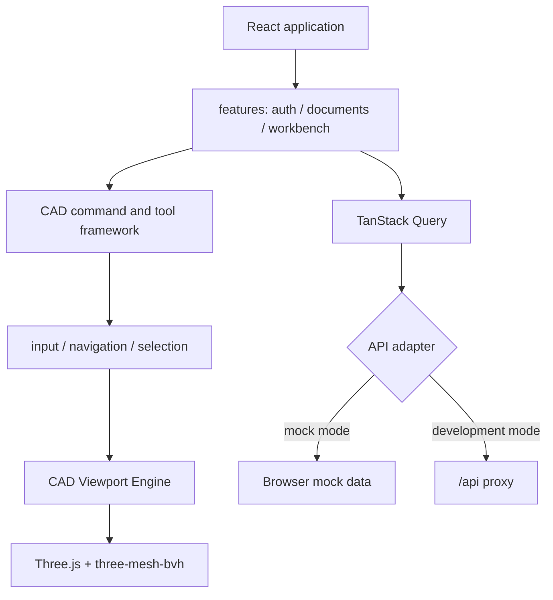

# CAD Web

CAD Web 是 occccad 的独立 React 应用，包含文档中心与浏览器 CAD 工作台。它可以连接真实 API，也可以用 Mock Adapter 单独开发。

## 当前能力

- 登录、注册、账号管理、文档/文件夹中心、分享与任务入口；
- Part/Product 多标签工作台、Specification Tree、Toolbar、Inspector；
- Three.js 精确网格显示、基准面、选择/预选与结构树联动；
- 草图矩形交互、拉伸、实例插入/移动、Undo/Redo；
- Default/CATIA 导航 Profile、Pointer Capture、快捷键上下文和 Overlay；
- TanStack Query 管理服务端状态，Zustand 管理工作台交互状态；
- Mock 与真实 HTTP 两种 API Adapter。

浏览器只负责交互和显示，不执行可信 B-Rep 运算，也不成为文档的权威存储。

## 结构



页面与功能层不得直接操作 Three.js Scene、Renderer 或 Controls；渲染资源通过 CAD Viewport Engine 管理。输入统一经过 CadInput/CadInteraction，避免每个工具自行注册全局事件。

## 依赖基线

当前使用 React 19、TypeScript 5.9、Vite 8、Ant Design 6、React Router 7、TanStack Query 5、Zustand 5、Three.js 0.179 和 three-mesh-bvh。准确范围以本目录 `package.json` 和锁文件为准。

## 运行

从仓库根目录：

```bash
# 无后端，默认 Mock Adapter
invoke run.web

# /api 代理到真实后端
invoke run.web --mode=api
```

或在 `web/` 目录：

```bash
pnpm install --frozen-lockfile
pnpm dev:mock
pnpm dev:api
```

默认开发地址为 `http://localhost:5173`。真实 API 模式的代理目标由 Vite 配置读取，当前默认指向本地应用入口。

## 验证

```bash
invoke web.build
```

该命令执行 TypeScript 类型检查和生产构建。仓库当前没有浏览器端自动化测试套件，复杂交互在扩展前应补充单元、组件和 Playwright 场景。

## 性能与安全边界

- 不为 Product 中每个实例重复下载相同 GeometryId 的 GLB；几何资源应去重并实例化渲染；
- 大装配需要渐进加载、LOD、可见性裁剪和批量拾取，不能一次构造完整 DOM/Scene；
- 任何客户端权限判断都只是体验优化，服务端必须再次鉴权；
- GLB/拓扑映射是显示制品，可以淘汰并重建；参数文档才是业务真相；
- WebGPU 可作为加速路径，但在兼容性与拾取语义成熟前保留 WebGL2/Three.js 基线。

长期前端数据流、实时协作和大装配方案见项目[目标架构](../../../docs/TARGET_ARCHITECTURE.md)。
