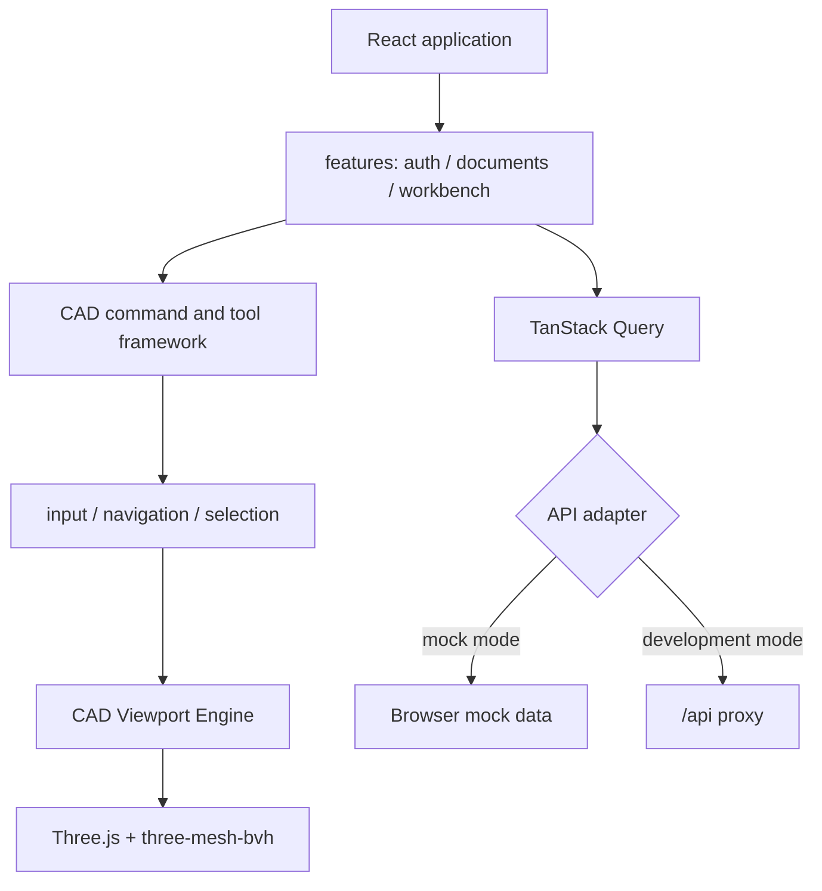

# CAD Web

CAD Web 是 occccad 的独立 React 应用，包含文档中心与浏览器 CAD 工作台。它可以连接真实 API，也可以用 Mock Adapter 单独开发。

## 当前能力

- 登录、注册、账号管理、文档/文件夹中心、分享与常驻消息中心；Document 使用 UUID 身份并允许显示名称重复，创建时提供可编辑的 `PartN`/`ProductN` 默认名称；消息中心恢复用户可见任务，展示进度和失败原因，并提供取消、重试、下载或打开文档动作；
- Part/Product 多标签工作台、Specification Tree、无文字 CAD 语义图标 Toolbar、Inspector；
- Toolbar 组成、工作台归属、顺序、短名称与详细帮助由后端 Presentation Catalog 下发；hover 只显示紧凑命令名，上边栏“这是什么？”进入一次性上下文帮助且不会触发命令，未知命令默认不显示且不可执行；
- Three.js 精确网格显示、基准面、集合化选择/预选与结构树联动；最终 Body 的视口选择归属最近的 Import/Extrude 节点，精确拓扑元素使用遮挡可见的面、宽边线和点 Overlay，树选父节点才展开全部后代；Specification Tree 支持 Ctrl/Meta 多选、Shift 连选和固定宽度的节点锚定右键菜单，选择变化关闭菜单，删除不确认并以一个原子 Revision 作用于当前选择集合，实体删除仍级联其引用约束；
- 草图绘制几何/约束/常用图形三组 Toolbar；Point、Line、Circle、Arc、Polyline、Spline、Rectangle、正六边形、长圆槽以及基础几何/尺寸约束；单击执行一次后回到选择，双击连续执行；
- 通用闭合 Profile（包含外环、孔和岛）拉伸、实例插入/移动、Undo/Redo；
- Default/CATIA 导航 Profile、Pointer Capture、Tool 手势状态机和 Overlay；Toolbar 命令不注册快捷键，Enter/Esc 只用于多阶段手势完成/取消；
- 版本化 `ui-preferences` 本地偏好统一保存 Inspector 开合与每组 Toolbar 的位置/方向；新增纯客户端显示偏好应扩展同一 schema，不再自行散写 localStorage key；
- 统一 CAD 语义色与 hover/selected/snap 层次；默认全开的捕获设置可分别过滤三维点、边、面、实体、草图、约束、基准面、基准轴/坐标系和实例，以及草图原点、点/端点、圆心、中点、Line/Circle/Arc/Spline 曲线投影和 10 mm 网格吸附；
- Pad、Insert、命名版本使用可拖动非模态命令面板；Pad 数值 blur/Enter 后请求后端复用正式 typed command、Sketch Solver 与 Part evaluator 生成非持久化精确预览，提交才创建 Revision；
- 草图原点和 H/V 基准轴是自动带入、可约束选择的稳定内在引用；第一次约束选择与第二候选同时高亮，点、端点、捕获点和拓扑顶点统一显示为 X 形；
- TanStack Query 管理服务端状态，Zustand 管理工作台交互状态；
- Mock Adapter，以及真实 REST + WebSocket 双平面 Adapter；
- 工作台通过 `occccad.realtime.v1` 订阅文档，建模命令走关联请求响应，其他浏览器提交后由 Outbox event 触发权威状态刷新；
- WebSocket 自动心跳、指数退避重连、重新订阅、sequence 去重/gap 恢复和事件确认。
- `features/activity` 把后端来源投影成统一 ActivityItem；当前接入持久 Job，只有存在活动任务时才低频刷新进度，未来通知来源通过独立 projector 扩展。

浏览器只负责交互和显示，不执行可信 B-Rep 运算，也不成为文档的权威存储。

## 结构



页面与功能层不得直接操作 Three.js Scene、Renderer 或 Controls；渲染资源通过 CAD Viewport Engine 管理。输入统一经过 CadInput/CadInteraction，避免每个工具自行注册全局事件。

## 依赖基线

当前使用 React 19、TypeScript 5.9、Vite 8、Ant Design 6、React Router 7、TanStack Query 5、Zustand 5、Three.js 0.179 和 three-mesh-bvh。准确范围以本目录 `package.json` 和锁文件为准。

## 运行

从仓库根目录：

```bash
# 无后端，默认 Mock Adapter
invoke run.web

# /api 代理到真实后端
invoke run.web --mode=api
```

或在 `web/` 目录：

```bash
pnpm install --frozen-lockfile
pnpm dev:mock
pnpm dev:api
```

默认开发地址为 `http://localhost:5173`。真实 API 模式的代理目标由 Vite 配置读取，当前默认指向本地应用入口。

文档缩略图使用服务端固定 `320×200`（`8:5`）SVG 画布；文档卡片保持相同宽高比并使用 `contain` 显示。服务端在缩略图尚未生成、超时或制品不可用时返回固定尺寸默认图，前端图片加载异常也只切换卡片内部 fallback，不改变卡片及下方文字布局。

## 验证

```bash
invoke web.build
invoke test --build-type=Debug
```

`invoke web.build` 执行 TypeScript 类型检查和生产构建。Front 行为场景邻近所属模块存放为 `src/**/testing/*.scenario.mjs`，`pnpm test` 自动发现并在独立进程运行，避免 fixture 和模块状态串扰；当前仍没有完整的浏览器/WebGL Playwright 套件，复杂视觉布局仍需浏览器验收。

## 性能与安全边界

- 不为 Product 中每个实例重复下载相同 GeometryId 的 GLB；几何资源应去重并实例化渲染；
- 大装配需要渐进加载、LOD、可见性裁剪和批量拾取，不能一次构造完整 DOM/Scene；
- 任何客户端权限判断都只是体验优化，服务端必须再次鉴权；
- GLB/拓扑映射是显示制品，可以淘汰并重建；参数文档才是业务真相；
- WebGPU 可作为加速路径，但在兼容性与拾取语义成熟前保留 WebGL2/Three.js 基线。

长期前端数据流、实时协作和大装配方案见项目[目标架构](../../../docs/TARGET_ARCHITECTURE.md)。
