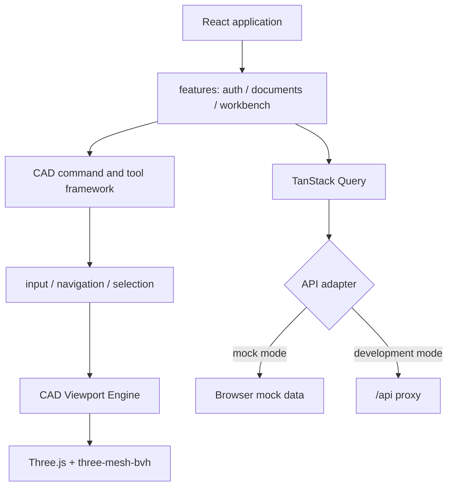

# CAD Web

CAD Web 是 occccad 的独立 React 应用，包含文档中心与浏览器 CAD 工作台。它可以连接真实 API，也可以用 Mock Adapter 单独开发。

## 当前能力

- 登录、注册、账号管理、文档/文件夹中心、分享与常驻消息中心；Document 使用 UUID 身份并允许显示名称重复，创建时提供可编辑的 `PartN`/`ProductN` 默认名称；消息中心恢复用户可见任务，展示进度和失败原因，并提供取消、重试、下载或打开文档动作；
- Part/Product 常驻文档标签、按上下文分组的图文命令区、可筛选的 Specification Tree、独立 WebGL 视口与可折叠 Inspector；
- Product 打开时默认激活根 occurrence；双击树中的 Product/Part/Instance 激活 typed InstancePath，并在保留根装配和其他部件的场景中就地编辑对应 Reference。视口 breadcrumb 明确显示上下文，可在 `打开定义` 与 `在此上下文打开` 间切换而不产生 Revision。Toolbar、属性、历史和命令绑定 Reference Document，草图与预览应用 occurrence 世界 Placement。Product 节点右键“新建零件”可留空自动分配 `PartN`，并以一个 ProductDesignTransaction 原子创建 Part、按 `PartN.N` 插入 occurrence、推进嵌套祖先引用；默认放在所选 Product 原点。Undo 移除 occurrence 但保留独立 Part 文档。Instance 右键“在新标签页中打开”通过工作台内部文档 Tab 打开其 Reference Document 当前 HEAD，已打开的文档复用 Tab。Insert 仍用于插入已有 Reference；默认 `FOLLOW_HEAD` 子文档通过递归实时订阅发现变化，并按叶到根自动接受带 digest 的 Product Update Plan。Broken/Impossible 约束保留诊断但不阻塞引用更新，也不会在源 HEAD 不变时反复触发更新；
- 命令组成、工作台归属、顺序、短名称与详细帮助由后端 Presentation Catalog 下发；命令区按建模/草图/装配、视图、文档与协作分类，撤销/重做和视图操作保留快捷入口；工具搜索包含当前工作台的已注册可见命令，不可用项可发现但不能执行；hover 使用统一深色提示显示命令名与已分配的快捷键，上边栏纯图标“这是什么？”进入一次性上下文帮助且不会触发命令，未知命令默认不显示且不可执行；
- Three.js 精确网格显示、基准面、集合化选择/预选与结构树联动；最终 Body 的视口选择归属最近的 Import/Extrude 节点，精确拓扑元素使用遮挡可见的面、宽边线和点 Overlay，树选父节点才展开全部后代；Specification Tree 支持 Ctrl/Meta 多选、Shift 连选和固定宽度的节点锚定右键菜单，选择变化关闭菜单，删除不确认并以一个原子 Revision 作用于当前选择集合，实体删除仍级联其引用约束；
- 基准面/轴沿用现有定义面板，支持自由框架或关联来源、绕参考直线旋转、沿参考方向平移；角度/距离可插入参数表达式。标准面/轴、基准、草图线和精确实体平面/直线边按角色拾取，复用权威预览与正式编辑命令，取消不写 Head。Origin 增加 Part 原点，XYZ/原点的树选择、hover 与 occurrence 显示共用身份。
- 实体 Feature 命令保留当前视图；旋转轴拾取把轮廓作淡色背景并突出单条轴线和 hover。树菜单抑制/恢复经专用 Domain Command 与 definition digest 检查。下游求值失败时视口以半透明红褐色显示有成功 Revision 来源的旧 Mesh，树/视口提示失败；旧结果仅供显示和导航，不参与建模拾取、权威文件下载或导出。
- 草图基本元素、轮廓、几何约束和尺寸约束使用独立命令分组；Point、Line、Circle、Arc、Ellipse、EllipticalArc、Polyline、FIT/CONTROL Spline、Rectangle、正多边形以及基础几何/尺寸约束；所有草图按钮单击单次、双击连续执行；
- Distance/Length/Radius/Diameter/Angle 驱动尺寸在属性面板显示稳定 ParameterId、可读别名、literal/expression 与计算值；Part Design 的“参数”面板加宽、限制高度并支持搜索；结构树按所属 Feature/Datum 分组。表达式可插入参数引用，权威预览显示计算值与错误，成功后才确认。新建线性拉伸可输入带单位长度、参数别名或表达式，也可从已有长度参数中直接选择；服务端在同一个创建事务中把表达式 AST 绑定 stable ID，因此重命名不会断开引用；
- Part Design 的“发布”面板创建和删除 Datum、Face/Edge、Body 与 Parameter Publication；结构树以稳定 PublicationId 显示接口，选中时仍使用实际 target 的视口选择身份定位，并在 Inspector 展示合同、resolved Revision、source digest 与 `BROKEN_PUBLICATION` 诊断。Publication 名称可直接编辑，稳定 ID 不变；参数面板可把本地参数发布。在 Product 中激活 Part 后，外部参数与其他输入通过当前 root snapshot 的可读 Context Catalog 按 occurrence breadcrumb/发布名称选择，不浏览所有文档也不手填 ID；
- Assembly Design 可直接选择子 Part Publication 建立约束，并通过“发布”面板沿嵌套 occurrence path 转发为 Product Publication；兼容 Replace/Update 重连新 target，不兼容合同显示 Broken。Part 在发布面板中声明 typed ContextInput，root Product 拥有 ContextBinding；创建绑定以一个多 Workspace transaction 原子更新消费 Part、嵌套 owning Product 链和 root Product，Undo/Redo 同样按事务组执行。ContextReference 只作为旧试点/独立外部引用能力保留，不与 Product binding 双写；
- Product 顶部显示显式 Update Plan，分别呈现引用连接、版本新旧和候选求值是否成功；同输入的共享 Part occurrence 复用 Context Variant 制品。`Product Release` 面板只在 CURRENT/READY/VERIFIED/SolveManifest gates 全部通过时冻结 dependency closure，并可对旧 Release 执行 replay 或提交 STEP/BREP 导出；
- “开始草图”可直接使用 DatumPlane 或稳定平面 Face。Face 选择只把当前 Revision 的 raw pick 作为绑定证据，返回的 Sketch 显示 PLANAR_FACE semantic anchor、support snapshot 与失败诊断；面支撑失败不会静默切回 XY；
- Sketcher 采用 in-context 场景分层：当前权威 Body 始终以原实体材质和独立常亮光照作为只读背景显示，活动 Sketch/Grid/Constraint 作为前景 overlay；全部 Sketch 始终进入渲染树，由“未消费默认显示、已消费默认隐藏、持久用户覆盖、编辑态临时显示”的统一策略决定可见性，结构树菜单显示同一有效状态。普通草图工具仍只能编辑活动 Sketch 元素，显式“投影”工具才把 Body Edge/Vertex 或原点/标准轴/基准轴绑定为独立 ExternalGeometry；方向投影是无限支撑线，垂直于草图面时为点；
- ExternalGeometry 使用稳定 ExternalId、PersistentSelection、权威二维快照与 source digest；投影线/完整圆/点可参加草图约束但不能拖动或冒充普通 Entity。活动 Sketch 曲线使用屏幕稳定宽度的遮挡可见 overlay，ExternalGeometry 使用更宽的青色虚线，因此与 Body Edge 重合时仍可辨识。结构树提供“断开并冻结”和 Reconnect，属性面板显示 semantic anchor、解析状态、诊断与受影响对象；新建或重连投影若返回稳定不支持/退化诊断，命令失败且保留原 Head，不会留下空投影节点；
- 通用闭合 Profile（包含外环、孔和岛）拉伸、实例插入/移动、Undo/Redo；装配操纵手柄提供轴/平面平移与轴旋转，拾取位置只作为近似抓取点；“以所选精确轴 / 法向操纵”通过服务端支持解析取得定向 descriptor，不从 mesh 推断求解方向。瞬态 solver Session 独立于文档编辑会话，冻结 nominal/frame/grab，单飞请求与最新目标排队，pointerup 采样最终坐标并等待匹配候选；确认复用服务端绑定的 MOVE 与幂等 requestId；
- 操纵接纳帧对所有受影响 occurrence 同步、立即应用姿态，刷新 glyph/helpers，不在两组可行位姿间独立插值，不为每帧重建 GLB。受限最优与预算/失败明确区分；取消恢复权威基线。提交结果未知时保留同一候选/请求供回执重试，不重造 MOVE。其他普通展示转换继续复用统一 transition 层；
- 装配约束分析是独立显式操作，带探测/时间预算、Revision/digest 与真实 oracle 证据，取消会向服务端停止分析。旧 Head 的报告禁用定位/修复；报告可定位约束及支持并进入既有编辑、重连、停用或合法测量命令。操纵目标不可达、数值未知、局部冗余与经过验证的不可约冲突不混为一谈，分析本身不推进 Revision 或隐式停用；
- Default/3DEXPERIENCE CATIA/SOLIDWORKS 导航 Profile、Pointer Capture、Tool 手势状态机和 Overlay；Default 右键旋转在完整模型可见时以可见内容包围盒中心为基准，拓扑点命中优先；局部放大时使用当前可见几何作为旋转参考；快捷键经统一 CommandRegistry 执行并遵循命令可用性；输入框、输入法组合输入及打开的命令面板不触发全局快捷键，Enter/Esc 仍用于多阶段手势完成/取消；
- 版本化 `ui-preferences` 本地偏好统一保存 Inspector 开合、结构树宽度、命令面板位置和浮动 Toolbar 布局；新增纯客户端显示偏好应扩展同一 schema，不再自行散写 localStorage key；
- 统一 CAD 语义色与 hover/selected/snap 层次；默认全开的捕获设置可分别过滤三维点、边、面、实体、草图、约束、基准面、基准轴/坐标系和实例，以及草图原点、点/端点、圆心、中点、Line/Circle/Arc/Spline 曲线投影和 10 mm 网格吸附；
- Pad、命名版本使用可拖动非模态命令面板；实体 Feature 长度/角度 literal/expression 和视图区几何输入变化后自动请求后端复用正式 typed command、参数求值、Sketch Solver 与 Part evaluator 生成非持久化精确预览，提交才创建 Revision；
- Product 约束创建和编辑共用非模态“约束定义”面板：分别显示 Constraint 的 NotUpdated/Broken/Impossible/Verified 与每个 Supporting Element 的 Connected/NotConnected；结构树双击/右键可编辑，Broken 可 Reconnect，非 Verified 可重新解析并求解。Reconnect 使用一次性视口选择，权威 preview 返回候选状态，确认以单个 `EDIT_ASSEMBLY_CONSTRAINT` Revision 提交；视口以不同 glyph 显示异常状态，并为已丢失的精确支持元素保留 instance 中心恢复标记；
- Cut/Hole 场景沿用同一状态投影：贯穿 Cut 保留的面继续显示 Connected/Verified，真实删除与 split 歧义显示 NotConnected/Broken，Reconnect 的当前制品 raw pick 只作为提交证据并由服务端绑定成 PersistentSelection；
- 同一交互和状态投影支持 Edge/Vertex：Vertex 作为精确 Point、线性 Edge 作为 Axis 参与 Vertex-Vertex、Vertex-Plane、Edge-Edge、Edge-Plane 约束；缺少 naming manifest 或 history 不完整时显示稳定诊断并进入 NotConnected/Broken，Reconnect 仍提交一次当前制品 raw pick，由服务端重新绑定稳定选择；
- 草图原点和 H/V 基准轴是自动带入、可约束选择的稳定内在引用；第一次约束选择与第二候选同时高亮，点、端点、捕获点和拓扑顶点统一显示为 X 形；
- TanStack Query 管理服务端状态，Zustand 管理工作台交互状态；
- Mock Adapter，以及真实 REST + WebSocket 双平面 Adapter；
- 工作台通过 `occccad.realtime.v1` 订阅文档，建模命令走关联请求响应，其他浏览器提交后由 Outbox event 触发权威状态刷新；
- WebSocket 自动心跳、指数退避重连、重新订阅、sequence 去重/gap 恢复和事件确认。
- 已有 Linear Extrude 的编辑器读取稳定 length Parameter 的 source；literal 和同一 Part 参数表达式均可原样显示、预览和提交，不再退化为求值后的数值；
- `features/activity` 把后端来源投影成统一 ActivityItem；当前接入持久 Job，只有存在活动任务时才低频刷新进度，未来通知来源通过独立 projector 扩展。

视觉基础由 `design/visual-tokens.ts` 统一提供，CSS、Ant Design 和 CAD rendering theme 使用同一语义色源。深色顶栏、浅色面板与蓝灰视口分层；实体使用柔和光照和低高光，选中为琥珀色、悬停为青色、预览为淡紫色。Shader 对点标记和手柄 glyph 使用导数抗锯齿，背景渐变使用稳定微量抖动。应用标识与 CAD 命令图标为原生 SVG。

插入组件使用独立模态资源浏览器：全部文档、最近打开、与我共享、文件夹逐层导航；支持名称/说明检索、零件/装配筛选、排序、每页 12 项，以及缩略图和位置详情。复用已有带 ACL 的后端分页检索与缩略图接口，不先下载全部文档。当前/根装配不可选，其他引用合法性仍由服务端验证；失败保留选择并允许重试。Mock 无真实制品时使用类型图标。

全局快捷键：Ctrl/Meta+Z 撤销，Ctrl/Meta+Y 或 Ctrl/Meta+Shift+Z 重做，Ctrl/Meta+K 搜索，V 选择，F 适合窗口，1/2/3/4 等轴/前/顶/右视图，L/C/R 草图直线/圆/矩形，? 查看帮助。工具提示和命令搜索同步显示快捷键；编辑文字时保留浏览器文字撤销。

浏览器只负责交互和显示，不执行可信 B-Rep 运算，也不成为文档的权威存储。

## 结构


```mermaid
flowchart TD
    App["React application"] --> Features["features: auth / documents / workbench"]
    Features --> Commands["CAD command and tool framework"]
    Commands --> Interaction["input / navigation / selection"]
    Interaction --> Viewport["CAD Viewport Engine"]
    Viewport --> Three["Three.js + three-mesh-bvh"]
    Features --> Query["TanStack Query"]
    Query --> Adapter{"API adapter"}
    Adapter -->|"mock mode"| Mock["Browser mock data"]
    Adapter -->|"development mode"| API["/api proxy"]
```

页面与功能层不得直接操作 Three.js Scene、Renderer 或 Controls；渲染资源通过 CAD Viewport Engine 管理。输入统一经过 CadInput/CadInteraction，避免每个工具自行注册全局事件。

草图命令按钮单击单次、双击连续执行。点、线、圆、圆弧、矩形、多边形、拟合点/控制点样条和椭圆工具共用 Input/Tool 生命周期；`C` 切换标准/辅助几何，`A` 切换自动连接，`Alt` 临时禁用自动连接而保留临时吸附，`Esc` 取消当前步骤后退出空闲工具，右键结束。两点工具提供长度/角度输入，矩形提供宽高输入，`Tab` 切换字段，`Enter` 确认；这些输入初始化几何，不自动成为持久驱动尺寸。连续轮廓用 `T` 切换直线/端部相切圆弧，圆弧与椭圆弧用 `R` 切换方向。椭圆支持主轴半径/角度（`Tab`）、次轴半径及椭圆弧起止参数角的分步数值输入（角单位为度、相对主轴）；每步 `Enter` 确认，完整几何最后一次原子提交。三点圆/弧、中心/定向矩形保持普通几何与正式连接/方向关系；样条界面区分经过拟合点的 `FIT` 和不必经过控制点的 `CONTROL`，后者使用显式 poles/knots/weights，闭合缝不承诺切向连续。

线性尺寸命令选择单线后暂定长度；显式选择第二条平行直线或点可改为距离，空白单击放置长度，Enter 锁定长度。锁定后的放置只改变标注位置，不再换对象；Backspace 在非文本区域退回未提交步骤。放置后以引线数值显示，点击数值或直接键入时就地编辑值/表达式，使用当前长度显示单位，确认通过正式尺寸命令及现有回执会话提交。显式“距离”命令与合法双预选继续可用。只有主动预选/选择会被工具消费，命令高亮和结果选集不成为下次输入。创建几何与外部投影提交等待权威结果，失败保留输入/引用；取消后的迟到结果不会完成已退出的工具。CAD 输入不处理面板文本和 IME 的键；显式引用选择子阶段可优先处理自己的 Esc。指针所有权从按下开始，hover 预览不能取得捕获或抢占其他手势的结束。

普通逻辑约束可从树中双击或编辑入口进入同一约束对话框，按约束能力过滤引用候选，并以稳定约束 ID 原子修改引用/停用状态或删除；生成的内部镜像/支撑关系须经对应几何编辑显式解除。FIT 精确裁剪/分割会保留原参数曲线子段并明确转为 CONTROL，拟合点引用不会静默重绑。

草图编辑工具接受预选或后选的本地实体，`Enter` 冻结选择与当前 document/Sketch/Revision/occurrence 上下文，随后输入或点击预览目标，再确认一次正式原子操作。移动通过同一手柄平移/旋转并实时求解跨选集连接，正式约束与尺寸保留；独立旋转与统一缩放入口已移除，`Shift+C` 切换带复制；复制与独立镜像用 `I` 选择内部约束或仅几何策略，后者明确不复制连接和尺寸。镜像默认关联模式，`M` 切换独立副本，`X/Y` 使用稳定内置轴。`Delete` 删除本地几何或普通约束选集；尺寸对话框提供明确的删除确认，表达式依赖由服务端原子拒绝，派生关联关系不能作为普通尺寸孤立删除；`Ctrl+C/X/V` 是独立的草图私有剪贴板，冻结源快照并保留所选内部逻辑关系，排除驱动尺寸、公式、Fixed 与跨选依赖。它与几何修剪分别命名。外部几何保持只读；刚性复制/编辑的依赖冲突由控制面拒绝；移动在约束可行域内跟随目标，不在前端偷偷解除约束。

移动手柄冻结一次操作的几何基线，合并实时只读求解请求，显示相连几何的权威候选；释放指针等待最后目标，再提交一次可撤销操作。求解失败保留选择，未知提交沿原回执恢复。中心手柄吸附仅使用可见草图元素，不吸附原点/背景网格，也不改变绘图吸附记录。单击工具执行一次，双击连续执行的规则不变。

人工验收：画两条共享重合端点的线，可另画重合点；只选择一条，启动“移动”，拖箭头和平面，再拖旋转环，检查相连端点跟随且尺寸不变；反向拖动、取消、Undo/Redo 和重新打开核对结果。固定一个端点/添加水平后重试，预览应保留限制并显示其余可动部分。拖动中心经过网格点不能跳到网格；经过几何端点应捕获。检查工具栏短名称且没有独立“旋转”。Node/RPC 测试不能代替实际 WebGL 与 Product occurrence 的人工验收。

编辑命令使用状态栏和就地输入。工具栏的样条线、矩形、圆、圆弧、多边形和样条控制采用主按钮与下拉变体；尺寸分为线性尺寸、轴尺寸、角度。主按钮执行当前方式，下拉选择立即执行并在浏览器本页会话（含刷新）中记住默认方式，单击/双击的单次/连续规则保持一致。只保留“修剪”入口：点击删除命中区间，无边界时删除整条。分割保留形状和 Coincident；闭合曲线需要两个位置。延伸选择曲线后移动/点击或拖动到目标；自由目标解析投影，捕获边界时走权威交点和连接。构造转换点选立即执行，合法预选整体转换。圆角/倒角两曲线完成后聚焦内联尺寸；拖动引线不改数值，输入改值生成候选。尺寸编辑直接显示值/表达式、名称、引用定位、停用、参考/驱动和删除，不再提供更多设置或尺寸引用更换；逻辑约束仍保留受控引用更换。正式复合操作成功后才完成，失败保留可修改草稿，未知结果沿原请求查询。

`sketch-linear-input.scenario.mjs` 验证暂定单线、明确平行第二对象、冻结放置、数量表达式/显示单位、非文本返回、选择来源及尺寸回执；`sketch-input-session.scenario.mjs` 使用真实 InputManager → InteractionRouter → ToolManager 事件路径，验证冻结尺寸定义、工具完成、选集、Esc、异步提交/回执重试及面板/IME 路由；

`sketch-creation.scenario.mjs` 验证真实创建状态机、数值输入、取消、Construction、三点圆弧、混合轮廓与样条模式；`sketch-edit.scenario.mjs` 验证正式操作定义、选择过滤、冻结上下文、镜像方向、剪贴板引用映射、零线线距离及连续拖动目标。运行 `pnpm test -- sketch-creation sketch-edit sketch-interaction`；这些场景与 TypeScript 构建不替代实机拾取、交互和 WebGL 验收。

Workbench 主文件编排文档、命令、查询、工具和领域面板生命周期。展示层按职责分开：

| 模块 | 职责 |
|---|---|
| `workbench-layout.tsx` / `workbench.css` | 命令区、结构树、视口、Inspector 与状态栏的布局；ResizeObserver、指针/键盘调宽与面板开合 |
| `workbench-command-model.ts` | 纯函数投影服务端目录、排序、分类、去重和搜索；不执行领域命令 |
| `workbench-commands.tsx` | 命令发现与执行入口；运行时状态来自 CommandRegistry |
| `insert-document-dialog.tsx` | 独立分页资源浏览器；目录、检索、缩略图、选择与失败重试 |
| `cad/command/command-shortcuts.ts` / `use-command-shortcuts.ts` | 快捷键声明、匹配与全局生命周期；复用 CommandRegistry |
| `design/visual-tokens.ts` / `design-system.css` | 统一语义色源、界面表面、控件和图标样式 |
| `document-tabs*.tsx` | 文档标签呈现与服务端已打开文档生命周期 |
| `tree-filter.ts` / `specification-tree.tsx` | 保留稳定身份和祖先的过滤、虚拟树、键盘导航及集合选择 |
| `workbench-inspector-panel.tsx` | 独立拥有属性/历史/拓扑查询，关闭即卸载；处理读取失败与只读历史操作 |
| `workbench-status.tsx` | 展示真实提交、选择、工具、单位与捕获状态；不推断保存成功 |
| `cad/overlay/floating-panel.tsx` | 非模态命令面板；位置归一化、容器边界、焦点、取消和重复提交保护 |

只读 Properties/History 位于 `features/workbench/workbench-inspector.tsx`，结构树 projection/selection mapping 位于 `features/workbench/workbench-tree-model.tsx`。属性、历史或树映射改动不需要加载主 orchestrator。默认属性页展示文档概览，内部 provenance/Worker 信息位于“技术详情与诊断”；所有对象另有默认展开的只读“完整对象数据与上下文”，保留定义、参数来源、SI 值、引用、诊断和制品元数据。`inspector-object-data.ts` 按稳定身份及文档/Revision 解析数据，跨文档检查复用只读查询；旧快照未加载时明确提示，不使用当前 Head 冒充。桌面工作台的结构树与属性栏占据独立网格列，不覆盖视口；窄于 800px 时属性栏改为可关闭的覆盖面板。命令组在空间不足时水平滚动。

交互边界：树筛选保留命中节点的祖先，命中父节点时保留其子树，不修改模型或选择身份；清空筛选恢复原展开状态。方向键/Home/End 移动树焦点，Enter/Space 选择。输入框、按钮、树与对话框中的按键不交给视口工具。浏览器原生右键仅在 CAD 视口和树节点上被接管。命令面板的持久位置统一进入 `ui-preferences` v4；旧的独立 `occccad.command-dialog.*` 键不再读取，新面板采用默认位置。

设计参考：[Onshape 工具搜索](https://cad.onshape.com/help/Content/Home/search_tools.htm)、[Onshape 界面分区](https://cad.onshape.com/help/Content/Home/user_interface_basics.htm)、[3DEXPERIENCE Action Bar](https://3dswym.3dexperience.3ds.com/post/makers-made-in-3d/simplifying-cad-the-xdesign-action-bar_aibePcuuQvetpsYllKSjkA)。CATIA B33 本机参考经 `control/BasEnglishC2.viewdoc` 定位到 `online/basug_C2/basugbt0501.htm`（Specification Tree and Geometry Area）及 `basugbt0510.htm`（Finding an Object in the Tree）；这些页面用于确认结构树与几何视区、树中查找的交互概念，不代表本项目已交付相同领域能力。采用上下文分组、可发现命令、文档标签和清楚的模型/视口分区，连续工具语义独立于导航模式。

鼠标导航的操作表、来源、状态机边界和未验证差异见 [导航说明](src/cad/navigation/README.md)。用户偏好可切换 3DEXPERIENCE CATIA 或 SOLIDWORKS，模式持久化到现有 UI preferences。CATIA 采用原生应用顺序组合键，旋转球默认隐藏，可在偏好中开启并持久化；SOLIDWORKS 支持 Ctrl/Shift/Alt 中键组合、中键双击适合窗口及独立的洋红色旋转参考。

这些变更建立了工作台展示分层，并不表示已实现成熟 CAD 的全部能力。领域编排仍集中在 `workbench.tsx`，大型装配性能、全量真实后端浏览器回归与更深入的特征编辑会话分层仍需要独立验证和演进。

## 依赖基线

当前使用 React 19、TypeScript 5.9、Vite 8、Ant Design 6、React Router 7、TanStack Query 5、Zustand 5、Three.js 0.179、three-mesh-bvh 和 Motion 13.2.0。Motion 通过本应用的 transform transition adapter 使用，不允许 Feature 或 React 页面直接持有其动画控制对象。准确范围以本目录 `package.json` 和锁文件为准。

## 运行

从仓库根目录：

```bash
# 无后端，默认 Mock Adapter
invoke run.web

# /api 代理到真实后端
invoke run.web --mode=api
```

或在 `web/` 目录：

```bash
pnpm install --frozen-lockfile
pnpm dev:mock
pnpm dev:api
```

默认开发地址为 `http://localhost:5173`。真实 API 模式的代理目标由 Vite 配置读取，当前默认指向本地应用入口。

文档缩略图使用服务端固定 `320×200`（`8:5`）SVG 画布；文档卡片保持相同宽高比并使用 `contain` 显示。服务端在缩略图尚未生成、超时或制品不可用时返回固定尺寸默认图，前端图片加载异常也只切换卡片内部 fallback，不改变卡片及下方文字布局。

## 验证

```bash
invoke web.build
invoke check --scope web
```

`invoke web.build` 执行 TypeScript 类型检查和生产构建。Front 行为场景邻近所属模块存放为 `src/**/testing/*.scenario.mjs`，`pnpm test` 自动发现并在独立进程运行，避免 fixture 和模块状态串扰；可用 `pnpm test -- sketch` 等路径/文件名片段筛选，`--list` 预览命中，`--verbose` 流式显示输出。默认成功只输出汇总，失败展开该场景诊断。`browser/workbench.spec.ts` 提供 Chromium/SwiftShader 的 Mock 浏览器回归，覆盖命令搜索/禁用态、草图工具、树过滤与键盘、面板尺寸、文档切换、1440/1024/768 布局，以及插入浏览器的分页/嵌套文件夹/检索/失败重试和历史快捷键。`browser/navigation.spec.ts` 另外验证 CATIA/SOLIDWORKS 的真实组合按键、临时旋转参考、失焦取消与中键双击，并保存旋转提示截图。它们不能代替真实后端几何、装配与复杂拾取验收。

浏览器回归独立于默认 Node scenarios，在 `web/apps/cad/` 运行 `pnpm exec playwright install --with-deps chromium` 安装浏览器及系统依赖，然后运行 `pnpm test:browser`。测试自动在独立端口 5174 启动 Mock Vite，失败时在已忽略的 `test-results/` 保存截图和 trace；测试结束关闭该进程。

已有 Linear Extrude 可从结构树右键 Edit 或双击打开同一个编辑器。长度输入接受显式 `mm/cm/m/in` 单位或同一 Part 参数表达式，并显示当前 Parameter source；同一次编辑会话的权威预览共享稳定 `interactionId` 并使用单调 `previewSequence`，确认时携带 definition digest 和一次性 `previewId` 提交一个 Revision。

## 性能与安全边界

- API Client 记录最近 200 次请求的浏览器总耗时、状态码与 `Server-Timing`，并在手动/自动诊断导出时携带这些样本；数据只保存在内存，不形成第二套业务状态；
- 命令返回的权威 `DocumentView` 直接进入 Query cache，不立即重复 GET。Inspector 折叠时不加载 Document Properties、History 或 Topology Properties，切换到对应页签时才按需加载；
- 不为 Product 中每个实例重复下载相同 GeometryId 的 GLB；几何资源应去重并实例化渲染；
- Render pose 是可丢弃的视觉状态：动态目标必须经 transition adapter，以当前显示帧重定向并在结束时精确落到权威 TRS；不得把动画中的 matrix 回写为 DocumentView 或命令 payload；
- 大装配需要渐进加载、LOD、可见性裁剪和批量拾取，不能一次构造完整 DOM/Scene；
- 任何客户端权限判断都只是体验优化，服务端必须再次鉴权；
- GLB/拓扑映射是显示制品，可以淘汰并重建；参数文档才是业务真相。Face/Edge/Vertex 的右侧属性面板同时显示服务端绑定的 Persistent Naming 状态、semantic anchor、selection recipe、supporting-element 状态与 evidence digest；local topology ID 只标识当前显示制品；
- WebGPU 可作为加速路径，但在兼容性与拾取语义成熟前保留 WebGL2/Three.js 基线。

长期前端数据流、实时协作和大装配方案见项目[目标架构](../../../docs/TARGET_ARCHITECTURE.md)。

装配约束预览面板消费 求解结果的 `assemblyComponents`，显示第二元素平移/旋转变化和每体瞬时自由度类型。
这些数据与预览结果共用 sequence 生命周期，新的请求、取消或关闭时清理，迟到响应不覆盖当前结果；前端不自行推断约束自由度。

Product 的 Debug 下载动作导出当前请求的 `.3dreplay`，Part 继续使用完整诊断包。
装配约束预览成功或失败后，面板的“下载 3dreplay”可下载该次数学输入与结果；取消面板后仍可通过 Debug 按钮下载。
请求键在发起时确定，旧响应不改写；刷新页面后选择数据库中最近的一次记录。解析前失败或记录不存在时明确提示，不以其他请求替代。

默认视口采用正交等轴测投影。快捷键 1 切换标准等轴测方向并按可见内容包围盒适合窗口；其他标准方向保留比例。独立“适合窗口”命令保留当前朝向。平移/拾取容差按当前 zoom 换算 CSS 像素。进入草图对齐支撑平面并保留比例，退出恢复进入前视图，同一草图刷新不重复对齐。相机数学与视图快照位于 `cad/navigation/orthographic-view.ts`；导航场景和浏览器用例覆盖高倍放大、等轴测重复切换、基准面/面支撑草图进入与退出。

底部网格使用独立背景通道的无限 XY 平面投影，随缩放调整网格密度，不受模型 near/far 裁剪或固定网格尺寸影响。正交相机 near 为 0，far 按实际几何深度与视图大小扩展；必要时沿视线后移相机以容纳眼后几何，保持屏幕位置和比例。

裁剪更新同时支持沿视线前移/后移相机；大幅缩小后重新放大时收回多余深度范围，避免裁剪范围随操作历史不断扩大。该沿视线位移不改变正交屏幕投影。

草图会话中底部“法线视图”恢复当前支撑面正视方向，保留缩放和关注区域，不要求预选；独立“正对草图平面”入口已删除。退出草图后结构树与视图区共享选择，点击空白清除两边高亮；选中的已消耗草图临时显示轮廓。世界网格在草图编辑期间继续显示，活动草图使用局部支撑平面的无限网格。背景使用世界上方向关联的环境渐变，可通过俯仰/滚转感知方向变化。命令目录通过 `0034_sketch_toolbar_variants.sql` 同步分组到 API，Mock 目录保持一致。

数值输入首次聚焦全选；纯数字长度使用当前文档显示单位，也接受显式单位和参数表达式。文档页签可拖动或用 Alt+左右键排序，会话内保留顺序并提供位移动画。实体预览将后端结果与原实体参考分层显示，融合/切除/交集提供颜色图例；草图网格采用青蓝点阵，与世界底面连续网格区分。

装配约束现可从树菜单（单项/约束集合）和定义面板停用/恢复，Inspector 区分激活状态、模式和测量值，停用 glyph 显示灰色。角度创建/编辑提供默认无轴0–360°空间角、指定轴0–360°投影角、平行、垂直四种模式；平行和垂直可从工具栏直接创建，垂直支持正向90°/反向270°意图。无轴角以连续扇区分支选择正反姿态，90°与270°产生相反解，不冻结旋转轴；绕轴角需要显式选择第二组件的稳定轴/直线/平面，可反向，服务端解析精确方向。Fix 提供空间/相对基准和位置/姿态六参数编辑，持久化仍为 quaternion。浏览器验收入口为 `browser/assembly-lifecycle.spec.ts`；完整六类入口、Contact 与多成员 Fix Together 仍以装配计划为准。

所有工作台的“视图”分组新增“法线视图”：选择基准面或实体平面后正对该平面，保留缩放，支持装配实例的空间变换。曲面没有唯一法线视图，会提示重新选择；操作不写模型历史。正式命令目录由迁移 `0026_normal_view.sql` 提供，与 Mock 目录一致。

进入草图、正对草图及法线视图先选择当前视线最近的法向侧，再对齐平面坐标轴，在四个90°间隔的朝向中选择旋转最少的一种，避免 X/Y 轴倾斜显示。切换和退出草图采用280 ms平滑动画，保留缩放与关注区域；连续命令从当前显示帧接续，鼠标/键盘操作可中断。该视图选择不翻转草图坐标系或模型面法向。

草图会话退出时，本次新建且未编辑、无几何/约束/外部投影的草图通过正常删除命令放弃；已有空草图的编辑会话不会被自动删除。直线拉伸默认沿持久草图平面法向正向，切除默认反向；切换 Body 操作时重新设置对应默认方向，用户仍可使用“反向”开关覆盖，预览和提交共用该值。

工作台消费服务端 Artifact 的 `naming` 能力与属性查询的 `namingDiagnostic`，展示未生成、生成不完整、损坏和合同不匹配的具体原因。已知不可绑定的面/边/点限制面上草图、拓扑发布、外部投影及拓扑约束入口，提交仍由服务端验证；基准几何、法线视图和 Instance/Body 级选择不因缺少 naming 被统一禁用。纯逻辑回归入口为 `topology-naming-capability.scenario.mjs`。

已有无命名定义的 ImportBody 在工作台告警中提供“建立导入命名”，调用正常 `REPAIR_IMPORT_NAMING` 命令并刷新权威 DocumentView；有编辑权限时可用，提交期间显示忙碌状态。修复形成新 Revision，可 Undo/Redo，未修复旧快照保持不可绑定诊断。

持久实体显示仅来自 `*.mesh.glb`，DocumentView 的 Artifact 只含摘要和角色引用。`cad/visual/visual-repository.ts` 负责鉴权下载、摘要校验、并发限制和按对象摘要去重；`mesh-glb.ts` 解码 `OCCCCAD_cad` 拾取映射。解码数据属于 viewport，不回写 API/Query 状态。临时预览以 `TRANSIENT_PREVIEW` 明确区分，同样只从 Artifact 引用加载 GLB。合同与当前内存限制见[几何表示](../../../docs/architecture/current/geometry-representations.md)。

CAD Command/Preview 使用 `api` 门面进入 `RealtimeClient`；取消由 AbortSignal 转为 preview cancel，断线不重放旧鼠标轨迹。订阅仅返回身份；命令可内联最多 64 KiB 的轻量业务快照，较大文档通过 HTTP snapshot 的一致 sequence 恢复权威状态。详见[realtime 控制面](../../../docs/architecture/current/realtime.md)。

草图 Select 支持左右方向的包含/交叉框选；全局 Delete 按语义选集和树节点能力执行删除。草图移动、旋转和复制使用共用平面手柄，释放原子提交，拖动仅预览；分割显示交点/端点吸附，圆弧及椭圆弧支持 Ctrl 临时反向并显示控制标记；尺寸文字附着草图平面，圆角/倒角候选复用同一尺寸显示。尺寸编辑允许既有视角导航并提供只读几何预览；具体合同与人工步骤见 [草图交互](../../../docs/sketch-inline-input.md)。

多边形：选择中心与构造圆半径，输入 3–50 的整数边数，Enter 一次提交。按 Onshape 的命名，内接方式的边与构造圆相切，外接方式的顶点位于构造圆上；帮助说明对应关系。后台生成带来源的普通线段、构造圆、重合、相等和相切/点在对象上关系，不引入特殊持久几何。构造圆半径可由已有尺寸工具驱动。

人工验收：从矩形下拉选中心矩形，退出/重新进入草图及刷新页面后点击主按钮，应继续启动中心矩形；用下拉恢复普通矩形。检查圆弧下拉保留中心圆弧、三点圆弧、椭圆弧各自原有流程。创建两种七边形，检查构造圆关系、修改半径、闭环拉伸和 Undo/Redo。旋转视角后在草图中点击底部法线视图，无预选也应正对当前草图；退出草图后该入口仍按选定平面工作。下拉的视觉/键盘/WebGL 体验需要人工验收，Node 与 Worker 测试不替代浏览器验收。

工具变体菜单使用统一的紧凑分体按钮与图标菜单，勾选当前方式。多边形中心阶段复用圆工具的捕获路径，悬停显示捕获候选，点击才接受中心引用。尺寸文字仍贴合草图平面并与尺寸线平行，视角旋转时仅允许平面内半圈翻转以保持阅读方向；缩放保持 CSS 像素大小。尺寸数值初始显示最多六位小数、去尾零，极小非零值保留科学计数；表达式原文及未修改的原始参数精度不变。

人工验收：在已有圆心附近悬停并点击创建多边形，检查捕获标记和正式连接；检查下拉的图标、选中勾号与键盘操作；旋转视角检查倾斜尺寸仍沿尺寸线且不倒置。双击尺寸后直接键入并 Enter，再检查定位、名称、停用、参考、删除及取消；单纯打开/确认不能舍入原参数。Node 场景不替代视觉、WebGL 与实际焦点的实机验收。

工作台呈现的唯一公共规格与组件入口见 [UI 规格](../../../docs/workbench-ui.md)。公共控件、Portal 面板、内联编辑与 WebGL 字体消费 `src/design/visual-tokens.ts`，几何反馈颜色保持独立语义。

### 实体 Feature 面板

Part Design 提供布尔、圆角、倒角、拔模、抽壳和基础放样命令。结构树的编辑入口使用同一 Feature 定义命令；局部修改通过“添加当前选择的边/面”取得服务端持久选择。预览与提交共用候选定义，输入变化、关闭及 Revision 变化使旧预览失效。工具 Body 的 consumed 状态不等于隐藏，视口不为已消耗结果创建实体和拾取对象。能力边界见[实体 Feature](../../../docs/architecture/current/solid-features.md)。

实体 Feature 的真实后端浏览器回归：先运行 `invoke run.app --build-type=Debug`，加载已配置的管理员登录环境后，在本目录执行 `pnpm exec playwright test --config playwright.live.config.ts`。该用例新建独立验收文档，不重置数据库；覆盖真实视图区布尔拾取/取消、倒角预选带入和编辑恢复、矩形到圆放样、自动预览、提交、精确体积和页面重开。测试打开输入诊断 Overlay 并根据当前相机投影点击真实 WebGL 视口。

实体 Feature 操作使用视图区角色拾取，几何输入不显示 UUID 下拉列表。命令前预选自动带入，边/面集点击添加、再次点击取消；输入完整后自动精确预览。局部特征编辑临时显示上游阶段并恢复持久边面高亮，取消恢复正式视图。旋转轴保留单条草图直线；放样默认自动对应有序截面，支持圆/多边形和首尾真实点端，点端通过独立拾取角色选择草图点或基准原点；可显示当前成功预览的连接线、逐截面调整闭合边/圆相位/方向。`feature-selection.ts` 拥有拾取角色过滤，Feature 面板拥有短期候选与绑定集合，Viewport 拥有显示/拾取生命周期，正式修改仍经既有命令与 CAS。
