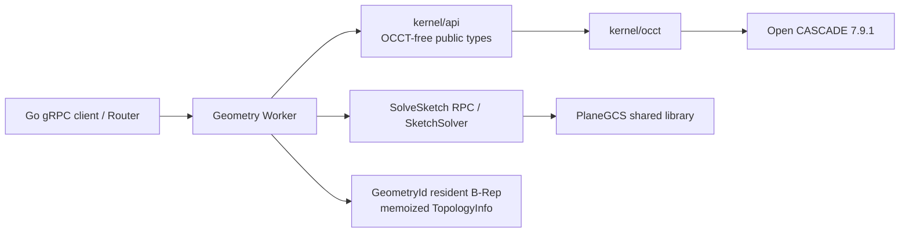

# Geometry Worker

Geometry Worker 是当前唯一的 C++ 网络计算服务。它通过粗粒度 gRPC 封装 OCCT，不向 Go 或浏览器暴露 OCCT 类型。

## 当前能力

- `Ping`：返回 Worker ID、OCCT 版本和 resident geometry 数；
- `SolveSketch`：求解版本化 Point/Line/Constraint SketchModel，返回坐标、状态、DoF 和冲突/冗余约束 ID；
- `EvaluatePart`：求值一个矩形草图/拉伸链或在基础 B-Rep 上追加拉伸；
- `InspectExchange` / `ImportExchange` / `ExportExchange`：通过 ArtifactReference 检查、导入和导出 STEP/BREP；
- `GetTopology`：返回面、边、点及诊断属性；
- 生成 SHA-256 GeometryId、B-Rep、三角网格、边折线、包围盒、体积和 GLB。
- 内置项目自有 `SketchSolver`/PlaneGCS 适配层；`GCS::*` 不进入公共头或 Proto。当前实体覆盖 Point/Line，约束覆盖 Coincident/Parallel/FixedPoint。

Proto 中已经声明但当前服务类没有覆盖的 `LoadGeometry`、`UnloadGeometry`、`Tessellate`、`CreateChamfer` 和 `CreateFillet` 会得到 gRPC `UNIMPLEMENTED`；协议声明不等于已交付能力。

## 内部结构



`kernel/api` 定义稳定值类型和操作接口，`kernel/occt` 是唯一允许暴露 OCCT 头文件的适配层。Worker 是易失计算容器，不是文档真相来源。

## 协议与数据

- 契约：`proto/occccad/worker/v1/geometry_worker.proto`
- 包名：`occcad.worker.v1`
- 传输：gRPC/Protobuf
- 默认监听：`127.0.0.1:51001`
- 配置：`OCCCCAD_GEOMETRY_WORKER_LISTEN`

调用应是“求值完整 Part”“导入一个交换根”“合成一次导出”一类粗粒度操作，不能把每个 OCCT 函数映射为远程 RPC。请求携带 `request_id` 与 `geometry_key`；Trace Context 通过 gRPC metadata 传播。B-Rep、GLB、STEP 和 BREP 交换文件通过 ArtifactReference 读写，不进入 unary gRPC bytes；当前 `LOCAL` backend 要求 Worker 与 API/Jobs 共享 `OCCCCAD_DATA_DIR`，object key 必须是根目录内的 opaque 相对键。

当前单 Body Part 以不可变 GeometryId 作为驻留原子。首次拓扑请求可以从 B-Rep Artifact 冷恢复，但 Router 会在 RPC 前预留同一 owner，Worker 随后缓存完整 `TopologyInfo`；选择其他面、边或点只过滤缓存，不重新读取 B-Rep 或遍历整个 Shape。未来多 Body Part 应为每个 Body 生成独立 GeometryId，而装配中的相同 Part occurrence 复用 GeometryId，仅区分 InstancePath/Transform。

## 日志

Worker 使用 spdlog 1.15.3 同时输出控制台与滚动文件。托管启动时 stdout/stderr 直接透传到终端，不再被 Go control 包装成 `service output message="..."`；Worker 生命周期日志仍由 control 记录。`OCCCCAD_LOG_LEVEL` 控制两类 sink 的级别；`OCCCCAD_LOG_DIR` 控制文件目录，`occccad-control` 默认把相对路径解析为 `services/logs/`。每个监听地址使用独立 `occccad-geometry-<address>.log`，单文件达到 10 MiB 后轮转并保留 5 个，避免多个 Worker 争写同一文件。日志包含启动、RPC、拓扑缓存命中、耗时和错误上下文，但不记录模型内容、凭据或制品 URL。

## 构建与运行

```bash
invoke configure --build-type=Debug
invoke build --build-type=Debug --target=occccad_geometry_worker
invoke run.worker --build-type=Debug
```

Geometry/PlaneGCS 测试源集中在根目录 `tests/cpp`。可运行全部 C++ 测试：

```bash
invoke test --build-type=Debug
```

只验证几何交换回归（包括 `models/` 中的真实 STEP 语料和多 root Product round-trip）：

```bash
invoke run.geometry --build-type=Debug
```

Worker `main` 仅负责启动 gRPC 服务，不包含 `--smoke` 或测试专用分支。

依赖版本以根 `conanfile.py` 为准，当前为 C++17、OCCT 7.9.1、gRPC 1.71.0、spdlog 1.15.3、Eigen 3.4.0 和 header-only Boost 1.86.0。PlaneGCS 锁定 FreeCAD 1.0.2 的不可变 commit，CMake 仅下载带逐文件 SHA-256 的官方核心源码清单，并构建为独立 shared library；不链接完整 FreeCAD。构建产物旁的 `LICENSE.FreeCAD-PlaneGCS` 必须随该库分发。

## 资源与故障语义

- resident geometry 只存在于进程内；Worker 退出后必须能从持久 B-Rep 或参数模型重建；
- GeometryId 基于内容，不得包含 Worker 地址；
- 同一个 Worker 内的 OCCT 操作当前由互斥边界保护，扩展吞吐优先增加进程而不是假设所有 OCCT 路径线程安全；
- 输入 STEP/BREP 是不可信复杂文件；当前 Worker 拒绝空对象、越界 object key 和超过 512 MiB 的制品，生产环境仍需要更严格的时间、内存、实体数量和进程级隔离；
- 计算请求必须可重试，调用方不能把 Worker 局部状态当成唯一副本。

## 目标边界

二维草图约束推荐作为 Part Evaluation 内的独立模块与本 Worker 同进程部署，以避免草图求解和特征重生成之间的高频网络往返；三维装配约束不进入本 Worker，应使用独立 Assembly Solver Worker。原因与拆分触发条件见项目[目标架构](../../docs/TARGET_ARCHITECTURE.md)。
