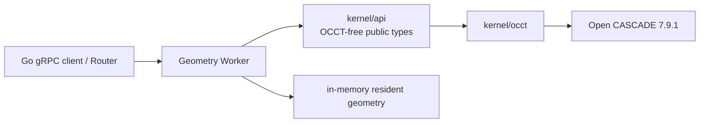

# Geometry Worker

Geometry Worker 是当前唯一的 C++ 网络计算服务。它通过粗粒度 gRPC 封装 OCCT，不向 Go 或浏览器暴露 OCCT 类型。

## 当前能力

- `Ping`：返回 Worker ID、OCCT 版本和 resident geometry 数；
- `EvaluatePart`：求值一个矩形草图/拉伸链或在基础 B-Rep 上追加拉伸；
- `ImportStep` / `ExportStep`：STEP 与内部 B-Rep 互换；
- `GetTopology`：返回面、边、点及诊断属性；
- 生成 SHA-256 GeometryId、B-Rep、三角网格、边折线、包围盒、体积和 GLB。

Proto 中已经声明但当前服务类没有覆盖的 `LoadGeometry`、`UnloadGeometry`、`Tessellate`、`CreateChamfer` 和 `CreateFillet` 会得到 gRPC `UNIMPLEMENTED`；协议声明不等于已交付能力。

## 内部结构



`kernel/api` 定义稳定值类型和操作接口，`kernel/occt` 是唯一允许暴露 OCCT 头文件的适配层。Worker 是易失计算容器，不是文档真相来源。

## 协议与数据

- 契约：`proto/occccad/worker/v1/geometry_worker.proto`
- 包名：`occcad.worker.v1`
- 传输：gRPC/Protobuf
- 默认监听：`127.0.0.1:51001`
- 配置：`OCCCCAD_GEOMETRY_WORKER_LISTEN`

调用应是“求值完整 Part”“导入 STEP”一类粗粒度操作，不能把每个 OCCT 函数映射为远程 RPC。请求携带 `request_id` 与 `geometry_key`；Trace Context 通过 gRPC metadata 传播。

## 构建与运行

```bash
invoke configure --build-type=Debug
invoke build --build-type=Debug --target=occccad_geometry_worker
invoke run.worker --build-type=Debug
```

几何冒烟程序：

```bash
invoke run.geometry --build-type=Debug
```

依赖版本以根 `conanfile.py` 为准，当前为 C++17、OCCT 7.9.1、gRPC 1.71.0。

## 资源与故障语义

- resident geometry 只存在于进程内；Worker 退出后必须能从持久 B-Rep 或参数模型重建；
- GeometryId 基于内容，不得包含 Worker 地址；
- 同一个 Worker 内的 OCCT 操作当前由互斥边界保护，扩展吞吐优先增加进程而不是假设所有 OCCT 路径线程安全；
- 输入 STEP 是不可信复杂文件，生产环境需要大小、时间、内存限制和进程级隔离；
- 计算请求必须可重试，调用方不能把 Worker 局部状态当成唯一副本。

## 目标边界

二维草图约束推荐作为 Part Evaluation 内的独立模块与本 Worker 同进程部署，以避免草图求解和特征重生成之间的高频网络往返；三维装配约束不进入本 Worker，应使用独立 Assembly Solver Worker。原因与拆分触发条件见项目[目标架构](../../docs/TARGET_ARCHITECTURE.md)。
